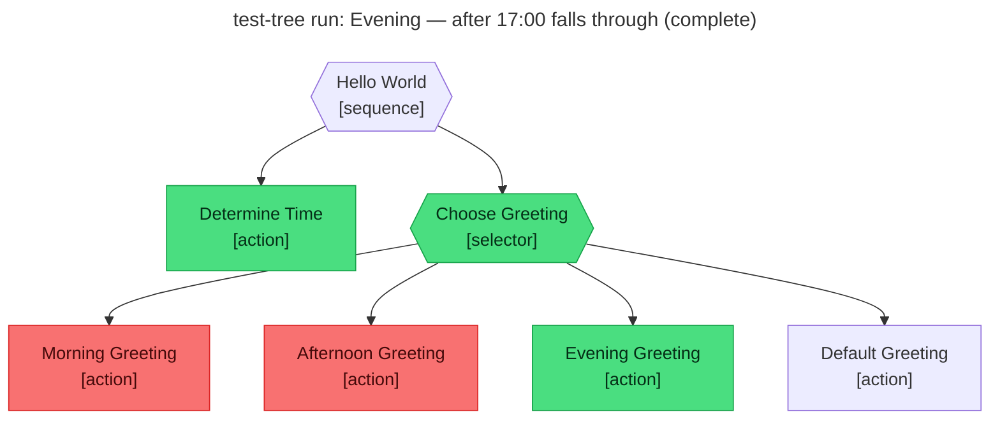

# Test report — Evening — after 17:00 falls through to Evening_Greeting

**Tree:** hello-world
**Spec:** .abtree/trees/hello-world/TEST__evening.yaml
**Target execution:** test-tree-run-evening-after-17-00-falls-__hello-world__1
**Overall:** PASS

## Final $LOCAL

| key | value |
|---|---|
| time_of_day | "evening" |
| greeting | "Good evening, John Doe — wind down and rest easy." |

## Assertions

| Name | Expected | Actual | Pass |
|---|---|---|---|
| status | done | done | ✓ |
| local.time_of_day | evening | evening | ✓ |
| local.greeting | starts with "Good evening" or "Evening" | "Good evening, John Doe — wind down and rest easy." | ✓ |

## Trace

