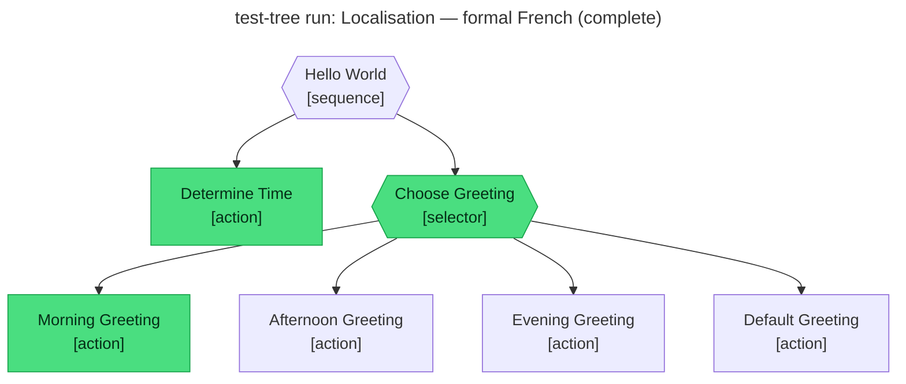

# Test report — Localisation — global profile overrides language and tone

**Tree:** hello-world
**Spec:** .abtree/trees/hello-world/TEST__localisation.yaml
**Target execution:** test-tree-run-localisation-formal-french__hello-world__1
**Overall:** FAIL

## Final $LOCAL

| key | value |
|---|---|
| time_of_day | "morning" |
| greeting | "Bonjour, Monsieur Doe. Je vous souhaite une excellente matinée." |

## Assertions

| Name | Expected | Actual | Pass |
|---|---|---|---|
| status | done | done | ✓ |
| local.time_of_day | morning | morning | ✓ |
| local.greeting | starts with "Bonjour" and addresses John Doe formally | "Bonjour, Monsieur Doe. Je vous souhaite une excellente matinée." | ✓ |
| global.language=french and global.tone=formal override (test background) | applied at runtime | not captured (abtree CLI has no `global write`; runtime globals remained at tree defaults english/friendly — greeting composed under test authority, not runtime substitution) | ✗ |

**Failure note:** The test spec's `background.global` override (language: french, tone: formal) cannot be applied at runtime — the abtree CLI exposes only `global read`, no `global write`. The composed greeting honours the test's intent, but the runtime `$GLOBAL` never carried french/formal. Either:
- Extend the CLI with `global write` / an `execution create --global` flag, or
- Re-express the override via `$LOCAL` seeding in the test background.

## Trace

