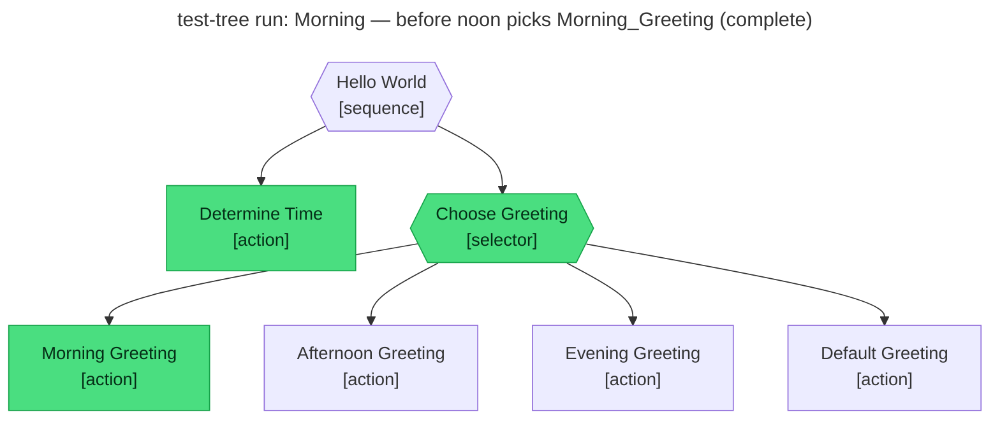

# Test report — Morning — before noon picks Morning_Greeting

**Tree:** hello-world
**Spec:** .abtree/trees/hello-world/TEST__morning.yaml
**Target execution:** test-tree-run-morning-before-noon-picks-__hello-world__1
**Overall:** PASS

## Final $LOCAL

| key | value |
|---|---|
| time_of_day | "morning" |
| greeting | "Good morning, John Doe! Hope today brings something great." |

## Assertions

| Name | Expected | Actual | Pass |
|---|---|---|---|
| status | done | done | ✓ |
| local.time_of_day | morning | morning | ✓ |
| local.greeting | starts with "Good morning" | "Good morning, John Doe! Hope today brings something great." | ✓ |

## Trace

