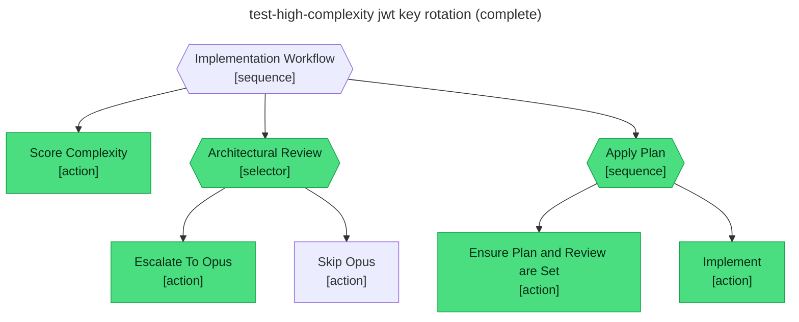

# Test report — High complexity escalates to the opus architect and the implement step passes after incorporating the review

**Tree:** implement (v3.0.0)
**Runner:** test-tree (v1.2.0, fixture-driven side effects)
**Spec:** .abtree/trees/implement/TEST__happy-path-high-complexity.yaml
**Target execution:** test-high-complexity-jwt-key-rotation__implement__1
**Overall:** PASS

## Final $LOCAL

| key | value |
|---|---|
| plan | "plans/jwt-signing-key-rotation-and-access-token-ttl-reduction.md" |
| complexity_score | 0.88 |
| architect_review | "approve_with_revisions: Add a graceful-rollover window for both keys; emit access-token age metric at verify time so we can confirm TTL adoption pre-rollout." |

## Assertions

| Name | Expected | Actual | Pass |
|---|---|---|---|
| status | done | done | ✓ |
| local.plan | non-empty | non-empty (63 chars) | ✓ |
| local.complexity_score | 0.88 | 0.88 | ✓ |
| local.architect_review | non-empty | non-empty (159 chars) | ✓ |
| runtime.retry_count.Implement | 0 | 0 | ✓ |

## Trace

