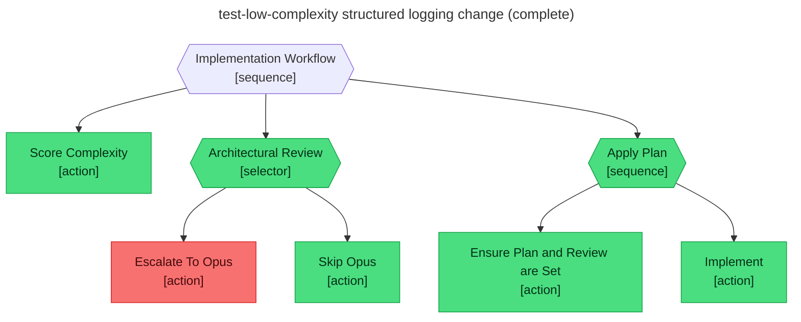

# Test report — Low complexity skips the architect review and the implement step passes on its first attempt

**Tree:** implement (v3.0.0)
**Runner:** test-tree (v1.2.0, fixture-driven side effects)
**Spec:** .abtree/trees/implement/TEST__happy-path-low-complexity.yaml
**Target execution:** test-low-complexity-structured-logging-c__implement__1
**Overall:** PASS

## Final $LOCAL

| key | value |
|---|---|
| plan | "plans/structured-logging-for-the-ingestion-service.md" |
| complexity_score | 0.40 |
| architect_review | "skipped" |

## Assertions

| Name | Expected | Actual | Pass |
|---|---|---|---|
| status | done | done | ✓ |
| local.plan | non-empty | non-empty (54 chars) | ✓ |
| local.complexity_score | 0.40 | 0.40 | ✓ |
| local.architect_review | skipped | skipped | ✓ |
| runtime.retry_count.Implement | 0 | 0 | ✓ |

## Trace

