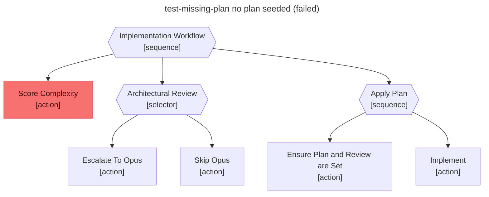

# Test report — No plan seeded → Score_Complexity guard fails and the workflow aborts on its first step

**Tree:** implement (v3.0.0)
**Runner:** test-tree (v1.2.0, fixture-driven side effects)
**Spec:** .abtree/trees/implement/TEST__missing-plan.yaml
**Target execution:** test-missing-plan-no-plan-seeded__implement__1
**Overall:** PASS

## Final $LOCAL

| key | value |
|---|---|
| plan | null |
| complexity_score | null |
| architect_review | null |

## Assertions

| Name | Expected | Actual | Pass |
|---|---|---|---|
| status | failure | failure | ✓ |
| local.plan | null | null | ✓ |
| local.complexity_score | null | null | ✓ |
| local.architect_review | null | null | ✓ |
| runtime.retry_count.Implement | 0 | 0 | ✓ |

## Trace

