# Test report — Baseline tests are red → Verify_Baseline aborts and no improvement work runs

**Tree:** improve-codebase (v1.1.0)
**Runner:** test-tree (v1.2.0, fixture-driven side effects)
**Spec:** .abtree/trees/improve-codebase/TEST__baseline-tests-fail.yaml
**Target execution:** test-baseline-tests-fail-auth-duplicatio__improve-codebase__1
**Overall:** PASS

## Final $LOCAL

| key | value |
|---|---|
| change_request | "Improve code quality across src/auth/ — duplication is hurting onboarding." |
| scope_confirmed | true |
| baseline_tests_pass | null |
| score_dry | null |
| score_srp | null |
| score_coupling | null |
| score_cohesion | null |
| baseline_scores | null |
| refactor_queue | null |
| done_log | [] |
| failed_log | [] |
| stage_halt | false |
| final_scores | null |

## Assertions

| Name | Expected | Actual | Pass |
|---|---|---|---|
| status | failure | failure | ✓ |
| local.change_request | non-empty | non-empty (75 chars) | ✓ |
| local.scope_confirmed | true | true | ✓ |
| local.baseline_tests_pass | null | null | ✓ |
| local.score_dry | null | null | ✓ |
| local.score_srp | null | null | ✓ |
| local.score_coupling | null | null | ✓ |
| local.score_cohesion | null | null | ✓ |
| local.baseline_scores | null | null | ✓ |
| local.refactor_queue | null | null | ✓ |
| local.done_log | [] | [] | ✓ |
| local.failed_log | [] | [] | ✓ |
| local.final_scores | null | null | ✓ |
| runtime.retry_count.Iterative_Refactor | 0 | 0 | ✓ |

## Trace

```mermaid
---
title: "test-baseline-tests-fail auth duplication (failed)"
---
flowchart TD
    Improve_Codebase{{"Improve Codebase\n[sequence]"}}
    0_Check_Intent["Check Intent\n[action]"]
    Improve_Codebase --> 0_Check_Intent
    style 0_Check_Intent fill:#4ade80,stroke:#16a34a,color:#052e16
    0_Verify_Baseline["Verify Baseline\n[action]"]
    Improve_Codebase --> 0_Verify_Baseline
    style 0_Verify_Baseline fill:#f87171,stroke:#dc2626,color:#450a0a
    0_Score_Quality_Metrics{{"Score Quality Metrics\n[parallel]"}}
    Improve_Codebase --> 0_Score_Quality_Metrics
    0_2_Score_DRY["Score DRY\n[action]"]
    0_Score_Quality_Metrics --> 0_2_Score_DRY
    0_2_Score_SRP["Score SRP\n[action]"]
    0_Score_Quality_Metrics --> 0_2_Score_SRP
    0_2_Score_Coupling["Score Coupling\n[action]"]
    0_Score_Quality_Metrics --> 0_2_Score_Coupling
    0_2_Score_Cohesion["Score Cohesion\n[action]"]
    0_Score_Quality_Metrics --> 0_2_Score_Cohesion
    0_Snapshot_Baseline["Snapshot Baseline\n[action]"]
    Improve_Codebase --> 0_Snapshot_Baseline
    0_Compile_Report["Compile Report\n[action]"]
    Improve_Codebase --> 0_Compile_Report
    0_Critique_Findings["Critique Findings\n[action]"]
    Improve_Codebase --> 0_Critique_Findings
    0_Lookup_Online["Lookup Online\n[action]"]
    Improve_Codebase --> 0_Lookup_Online
    0_Triage_Refactor_Queue["Triage Refactor Queue\n[action]"]
    Improve_Codebase --> 0_Triage_Refactor_Queue
    0_Triage_Approval_Gate["Triage Approval Gate\n[action]"]
    Improve_Codebase --> 0_Triage_Approval_Gate
    0_Iterative_Refactor{{"Iterative Refactor\n[sequence]"}}
    Improve_Codebase --> 0_Iterative_Refactor
    0_9_Halt_Check["Halt Check\n[action]"]
    0_Iterative_Refactor --> 0_9_Halt_Check
    0_9_Pick_Next_Item["Pick Next Item\n[action]"]
    0_Iterative_Refactor --> 0_9_Pick_Next_Item
    0_9_Refactor_Item{{"Refactor Item\n[sequence]"}}
    0_Iterative_Refactor --> 0_9_Refactor_Item
    0_9_2_Pre_Refactor_Critique{{"Pre Refactor Critique\n[selector]"}}
    0_9_Refactor_Item --> 0_9_2_Pre_Refactor_Critique
    0_9_2_0_High_Risk_Critique["High Risk Critique\n[action]"]
    0_9_2_Pre_Refactor_Critique --> 0_9_2_0_High_Risk_Critique
    0_9_2_0_Skip_Critique["Skip Critique\n[action]"]
    0_9_2_Pre_Refactor_Critique --> 0_9_2_0_Skip_Critique
    0_9_2_Implement_Refactor["Implement Refactor\n[action]"]
    0_9_Refactor_Item --> 0_9_2_Implement_Refactor
    0_9_2_Regression_Test["Regression Test\n[action]"]
    0_9_Refactor_Item --> 0_9_2_Regression_Test
    0_9_2_Reassess_Metric["Reassess Metric\n[action]"]
    0_9_Refactor_Item --> 0_9_2_Reassess_Metric
    0_9_Record_Item_Done["Record Item Done\n[action]"]
    0_Iterative_Refactor --> 0_9_Record_Item_Done
    0_9_Continue_Or_Done["Continue Or Done\n[action]"]
    0_Iterative_Refactor --> 0_9_Continue_Or_Done
    0_Final_Reassessment["Final Reassessment\n[action]"]
    Improve_Codebase --> 0_Final_Reassessment
    0_Cycle_Verdict{{"Cycle Verdict\n[selector]"}}
    Improve_Codebase --> 0_Cycle_Verdict
    0_11_Cycle_Passed["Cycle Passed\n[action]"]
    0_Cycle_Verdict --> 0_11_Cycle_Passed
    0_11_Cycle_Partial["Cycle Partial\n[action]"]
    0_Cycle_Verdict --> 0_11_Cycle_Partial
```

