# Test report — Full cycle — two items refactored cleanly, every metric clears threshold, Cycle_Passed wins

**Tree:** improve-codebase (v1.1.0)
**Runner:** test-tree (v1.2.0, fixture-driven side effects)
**Spec:** .abtree/trees/improve-codebase/TEST__happy-path-cycle-passes.yaml
**Target execution:** test-cycle-passes-handlers-dry-srp__improve-codebase__1
**Overall:** PASS

## Final $LOCAL

| key | value |
|---|---|
| change_request | "Improve DRY and SRP across the request-handler module before we expand the API surface." |
| scope_confirmed | true |
| baseline_tests_pass | true |
| score_dry | { score: 0.52, observations: [users.ts] } |
| score_srp | { score: 0.61, observations: [orders.ts] } |
| score_coupling | { score: 0.74 } |
| score_cohesion | { score: 0.71 } |
| baseline_scores | { dry: 0.52, srp: 0.61, coupling: 0.74, cohesion: 0.71 } |
| refactor_queue | [] |
| done_log | [dry-1 @ 0.84, srp-1 @ 0.82] |
| failed_log | [] |
| stage_halt | false |
| final_scores | { dry: 0.84, srp: 0.82, coupling: 0.74, cohesion: 0.71 } |
| online_references | { dry: [2], srp: [2] } |

## Assertions

| Name | Expected | Actual | Pass |
|---|---|---|---|
| status | done | done | ✓ |
| local.change_request | non-empty | non-empty (88 chars) | ✓ |
| local.scope_confirmed | true | true | ✓ |
| local.baseline_tests_pass | true | true | ✓ |
| local.baseline_scores | non-empty | non-empty | ✓ |
| local.refactor_queue | empty | empty | ✓ |
| local.done_log | non-empty | non-empty (2 items) | ✓ |
| local.failed_log | empty | empty | ✓ |
| local.stage_halt | false | false | ✓ |
| local.final_scores | non-empty | non-empty (all ≥ 0.7) | ✓ |
| runtime.retry_count.Refactor_Item | 0 | 0 | ✓ |

## Trace

```mermaid
---
title: "test-cycle-passes handlers DRY SRP (complete)"
---
flowchart TD
    Improve_Codebase{{"Improve Codebase\n[sequence]"}}
    0_Check_Intent["Check Intent\n[action]"]
    Improve_Codebase --> 0_Check_Intent
    style 0_Check_Intent fill:#4ade80,stroke:#16a34a,color:#052e16
    0_Verify_Baseline["Verify Baseline\n[action]"]
    Improve_Codebase --> 0_Verify_Baseline
    style 0_Verify_Baseline fill:#4ade80,stroke:#16a34a,color:#052e16
    0_Score_Quality_Metrics{{"Score Quality Metrics\n[parallel]"}}
    Improve_Codebase --> 0_Score_Quality_Metrics
    style 0_Score_Quality_Metrics fill:#4ade80,stroke:#16a34a,color:#052e16
    0_2_Score_DRY["Score DRY\n[action]"]
    0_Score_Quality_Metrics --> 0_2_Score_DRY
    style 0_2_Score_DRY fill:#4ade80,stroke:#16a34a,color:#052e16
    0_2_Score_SRP["Score SRP\n[action]"]
    0_Score_Quality_Metrics --> 0_2_Score_SRP
    style 0_2_Score_SRP fill:#4ade80,stroke:#16a34a,color:#052e16
    0_2_Score_Coupling["Score Coupling\n[action]"]
    0_Score_Quality_Metrics --> 0_2_Score_Coupling
    style 0_2_Score_Coupling fill:#4ade80,stroke:#16a34a,color:#052e16
    0_2_Score_Cohesion["Score Cohesion\n[action]"]
    0_Score_Quality_Metrics --> 0_2_Score_Cohesion
    style 0_2_Score_Cohesion fill:#4ade80,stroke:#16a34a,color:#052e16
    0_Snapshot_Baseline["Snapshot Baseline\n[action]"]
    Improve_Codebase --> 0_Snapshot_Baseline
    style 0_Snapshot_Baseline fill:#4ade80,stroke:#16a34a,color:#052e16
    0_Compile_Report["Compile Report\n[action]"]
    Improve_Codebase --> 0_Compile_Report
    style 0_Compile_Report fill:#4ade80,stroke:#16a34a,color:#052e16
    0_Critique_Findings["Critique Findings\n[action]"]
    Improve_Codebase --> 0_Critique_Findings
    style 0_Critique_Findings fill:#4ade80,stroke:#16a34a,color:#052e16
    0_Lookup_Online["Lookup Online\n[action]"]
    Improve_Codebase --> 0_Lookup_Online
    style 0_Lookup_Online fill:#4ade80,stroke:#16a34a,color:#052e16
    0_Triage_Refactor_Queue["Triage Refactor Queue\n[action]"]
    Improve_Codebase --> 0_Triage_Refactor_Queue
    style 0_Triage_Refactor_Queue fill:#4ade80,stroke:#16a34a,color:#052e16
    0_Triage_Approval_Gate["Triage Approval Gate\n[action]"]
    Improve_Codebase --> 0_Triage_Approval_Gate
    style 0_Triage_Approval_Gate fill:#4ade80,stroke:#16a34a,color:#052e16
    0_Iterative_Refactor{{"Iterative Refactor\n[sequence]"}}
    Improve_Codebase --> 0_Iterative_Refactor
    style 0_Iterative_Refactor fill:#4ade80,stroke:#16a34a,color:#052e16
    0_9_Halt_Check["Halt Check\n[action]"]
    0_Iterative_Refactor --> 0_9_Halt_Check
    style 0_9_Halt_Check fill:#4ade80,stroke:#16a34a,color:#052e16
    0_9_Pick_Next_Item["Pick Next Item\n[action]"]
    0_Iterative_Refactor --> 0_9_Pick_Next_Item
    style 0_9_Pick_Next_Item fill:#4ade80,stroke:#16a34a,color:#052e16
    0_9_Refactor_Item{{"Refactor Item\n[sequence]"}}
    0_Iterative_Refactor --> 0_9_Refactor_Item
    style 0_9_Refactor_Item fill:#4ade80,stroke:#16a34a,color:#052e16
    0_9_2_Pre_Refactor_Critique{{"Pre Refactor Critique\n[selector]"}}
    0_9_Refactor_Item --> 0_9_2_Pre_Refactor_Critique
    style 0_9_2_Pre_Refactor_Critique fill:#4ade80,stroke:#16a34a,color:#052e16
    0_9_2_0_High_Risk_Critique["High Risk Critique\n[action]"]
    0_9_2_Pre_Refactor_Critique --> 0_9_2_0_High_Risk_Critique
    style 0_9_2_0_High_Risk_Critique fill:#f87171,stroke:#dc2626,color:#450a0a
    0_9_2_0_Skip_Critique["Skip Critique\n[action]"]
    0_9_2_Pre_Refactor_Critique --> 0_9_2_0_Skip_Critique
    style 0_9_2_0_Skip_Critique fill:#4ade80,stroke:#16a34a,color:#052e16
    0_9_2_Implement_Refactor["Implement Refactor\n[action]"]
    0_9_Refactor_Item --> 0_9_2_Implement_Refactor
    style 0_9_2_Implement_Refactor fill:#4ade80,stroke:#16a34a,color:#052e16
    0_9_2_Regression_Test["Regression Test\n[action]"]
    0_9_Refactor_Item --> 0_9_2_Regression_Test
    style 0_9_2_Regression_Test fill:#4ade80,stroke:#16a34a,color:#052e16
    0_9_2_Reassess_Metric["Reassess Metric\n[action]"]
    0_9_Refactor_Item --> 0_9_2_Reassess_Metric
    style 0_9_2_Reassess_Metric fill:#4ade80,stroke:#16a34a,color:#052e16
    0_9_Record_Item_Done["Record Item Done\n[action]"]
    0_Iterative_Refactor --> 0_9_Record_Item_Done
    style 0_9_Record_Item_Done fill:#4ade80,stroke:#16a34a,color:#052e16
    0_9_Continue_Or_Done["Continue Or Done\n[action]"]
    0_Iterative_Refactor --> 0_9_Continue_Or_Done
    style 0_9_Continue_Or_Done fill:#4ade80,stroke:#16a34a,color:#052e16
    0_Final_Reassessment["Final Reassessment\n[action]"]
    Improve_Codebase --> 0_Final_Reassessment
    style 0_Final_Reassessment fill:#4ade80,stroke:#16a34a,color:#052e16
    0_Cycle_Verdict{{"Cycle Verdict\n[selector]"}}
    Improve_Codebase --> 0_Cycle_Verdict
    style 0_Cycle_Verdict fill:#4ade80,stroke:#16a34a,color:#052e16
    0_11_Cycle_Passed["Cycle Passed\n[action]"]
    0_Cycle_Verdict --> 0_11_Cycle_Passed
    style 0_11_Cycle_Passed fill:#4ade80,stroke:#16a34a,color:#052e16
    0_11_Cycle_Partial["Cycle Partial\n[action]"]
    0_Cycle_Verdict --> 0_11_Cycle_Partial
```

