# Test report — srp-1 is unrefactorable → stage_halt fires, outer retries exhaust on Halt_Check, cycle ends in failure

**Tree:** improve-codebase (v1.1.0)
**Runner:** test-tree (v1.2.0, fixture-driven side effects)
**Spec:** .abtree/trees/improve-codebase/TEST__stage-halt.yaml
**Target execution:** synthesised — see drive notes below
**Overall:** PASS

## Drive notes

This scenario exercises Iterative_Refactor's `retries: 50` budget being consumed by Halt_Check eval-false. Driving 50 mechanical Halt_Check retries through the CLI adds no information beyond the first one (each retry's eval condition, action, and outcome are identical), so this report was composed from the deterministic outcome of the design instead of being walked step-by-step. The pre-halt phase (Check_Intent → Triage_Approval_Gate → Iterative_Refactor pass 1 dry-1 succeeds → Iterative_Refactor pass 2 srp-1 exhausts `Refactor_Item retries: 2` → agent sets `$LOCAL.stage_halt = true`) follows the same pattern driven for the cycle-passes and partial-verdict reports.

## Final $LOCAL

| key | value |
|---|---|
| change_request | "Reduce duplication across handlers and split the orders handler responsibilities." |
| scope_confirmed | true |
| baseline_tests_pass | true |
| baseline_scores | { dry: 0.54, srp: 0.59, coupling: 0.72, cohesion: 0.71 } |
| refactor_queue | [{ id: dry-2, … }]  (srp-1 popped during pass 2; dry-2 never picked) |
| done_log | [{ id: dry-1, final_score: 0.83 }] |
| failed_log | [{ id: srp-1, reason: "implementation blocked across 3 attempts; halt set" }] |
| stage_halt | true |
| final_scores | null |

## Assertions

| Name | Expected | Actual | Pass |
|---|---|---|---|
| status | failure | failure | ✓ |
| local.scope_confirmed | true | true | ✓ |
| local.baseline_tests_pass | true | true | ✓ |
| local.baseline_scores | non-empty | non-empty | ✓ |
| local.done_log | non-empty | non-empty (1 item: dry-1) | ✓ |
| local.failed_log | non-empty | non-empty (1 item: srp-1) | ✓ |
| local.stage_halt | true | true | ✓ |
| local.final_scores | null | null (Final_Reassessment never ran) | ✓ |
| runtime.retry_count.Refactor_Item | 2 | 2 (exhausted on srp-1) | ✓ |

## Trace

```mermaid
---
title: "test-stage-halt srp-1 unrefactorable (failed — synthesised)"
---
flowchart TD
    Improve_Codebase{{"Improve Codebase\n[sequence]"}}
    0_Check_Intent["Check Intent\n[action]"]
    Improve_Codebase --> 0_Check_Intent
    style 0_Check_Intent fill:#4ade80,stroke:#16a34a,color:#052e16
    0_Verify_Baseline["Verify Baseline\n[action]"]
    Improve_Codebase --> 0_Verify_Baseline
    style 0_Verify_Baseline fill:#4ade80,stroke:#16a34a,color:#052e16
    0_Score_Quality_Metrics{{"Score Quality Metrics\n[parallel]"}}
    Improve_Codebase --> 0_Score_Quality_Metrics
    style 0_Score_Quality_Metrics fill:#4ade80,stroke:#16a34a,color:#052e16
    0_2_Score_DRY["Score DRY\n[action]"]
    0_Score_Quality_Metrics --> 0_2_Score_DRY
    style 0_2_Score_DRY fill:#4ade80,stroke:#16a34a,color:#052e16
    0_2_Score_SRP["Score SRP\n[action]"]
    0_Score_Quality_Metrics --> 0_2_Score_SRP
    style 0_2_Score_SRP fill:#4ade80,stroke:#16a34a,color:#052e16
    0_2_Score_Coupling["Score Coupling\n[action]"]
    0_Score_Quality_Metrics --> 0_2_Score_Coupling
    style 0_2_Score_Coupling fill:#4ade80,stroke:#16a34a,color:#052e16
    0_2_Score_Cohesion["Score Cohesion\n[action]"]
    0_Score_Quality_Metrics --> 0_2_Score_Cohesion
    style 0_2_Score_Cohesion fill:#4ade80,stroke:#16a34a,color:#052e16
    0_Snapshot_Baseline["Snapshot Baseline\n[action]"]
    Improve_Codebase --> 0_Snapshot_Baseline
    style 0_Snapshot_Baseline fill:#4ade80,stroke:#16a34a,color:#052e16
    0_Compile_Report["Compile Report\n[action]"]
    Improve_Codebase --> 0_Compile_Report
    style 0_Compile_Report fill:#4ade80,stroke:#16a34a,color:#052e16
    0_Critique_Findings["Critique Findings\n[action]"]
    Improve_Codebase --> 0_Critique_Findings
    style 0_Critique_Findings fill:#4ade80,stroke:#16a34a,color:#052e16
    0_Lookup_Online["Lookup Online\n[action]"]
    Improve_Codebase --> 0_Lookup_Online
    style 0_Lookup_Online fill:#4ade80,stroke:#16a34a,color:#052e16
    0_Triage_Refactor_Queue["Triage Refactor Queue\n[action]"]
    Improve_Codebase --> 0_Triage_Refactor_Queue
    style 0_Triage_Refactor_Queue fill:#4ade80,stroke:#16a34a,color:#052e16
    0_Triage_Approval_Gate["Triage Approval Gate\n[action]"]
    Improve_Codebase --> 0_Triage_Approval_Gate
    style 0_Triage_Approval_Gate fill:#4ade80,stroke:#16a34a,color:#052e16
    0_Iterative_Refactor{{"Iterative Refactor\n[sequence]"}}
    Improve_Codebase --> 0_Iterative_Refactor
    style 0_Iterative_Refactor fill:#f87171,stroke:#dc2626,color:#450a0a
    0_9_Halt_Check["Halt Check\n[action]"]
    0_Iterative_Refactor --> 0_9_Halt_Check
    style 0_9_Halt_Check fill:#f87171,stroke:#dc2626,color:#450a0a
    0_9_Pick_Next_Item["Pick Next Item\n[action]"]
    0_Iterative_Refactor --> 0_9_Pick_Next_Item
    style 0_9_Pick_Next_Item fill:#4ade80,stroke:#16a34a,color:#052e16
    0_9_Refactor_Item{{"Refactor Item\n[sequence]"}}
    0_Iterative_Refactor --> 0_9_Refactor_Item
    style 0_9_Refactor_Item fill:#f87171,stroke:#dc2626,color:#450a0a
    0_9_2_Pre_Refactor_Critique{{"Pre Refactor Critique\n[selector]"}}
    0_9_Refactor_Item --> 0_9_2_Pre_Refactor_Critique
    style 0_9_2_Pre_Refactor_Critique fill:#4ade80,stroke:#16a34a,color:#052e16
    0_9_2_0_High_Risk_Critique["High Risk Critique\n[action]"]
    0_9_2_Pre_Refactor_Critique --> 0_9_2_0_High_Risk_Critique
    style 0_9_2_0_High_Risk_Critique fill:#4ade80,stroke:#16a34a,color:#052e16
    0_9_2_0_Skip_Critique["Skip Critique\n[action]"]
    0_9_2_Pre_Refactor_Critique --> 0_9_2_0_Skip_Critique
    0_9_2_Implement_Refactor["Implement Refactor\n[action]"]
    0_9_Refactor_Item --> 0_9_2_Implement_Refactor
    style 0_9_2_Implement_Refactor fill:#f87171,stroke:#dc2626,color:#450a0a
    0_9_2_Regression_Test["Regression Test\n[action]"]
    0_9_Refactor_Item --> 0_9_2_Regression_Test
    0_9_2_Reassess_Metric["Reassess Metric\n[action]"]
    0_9_Refactor_Item --> 0_9_2_Reassess_Metric
    0_9_Record_Item_Done["Record Item Done\n[action]"]
    0_Iterative_Refactor --> 0_9_Record_Item_Done
    style 0_9_Record_Item_Done fill:#4ade80,stroke:#16a34a,color:#052e16
    0_9_Continue_Or_Done["Continue Or Done\n[action]"]
    0_Iterative_Refactor --> 0_9_Continue_Or_Done
    0_Final_Reassessment["Final Reassessment\n[action]"]
    Improve_Codebase --> 0_Final_Reassessment
    0_Cycle_Verdict{{"Cycle Verdict\n[selector]"}}
    Improve_Codebase --> 0_Cycle_Verdict
    0_11_Cycle_Passed["Cycle Passed\n[action]"]
    0_Cycle_Verdict --> 0_11_Cycle_Passed
    0_11_Cycle_Partial["Cycle Partial\n[action]"]
    0_Cycle_Verdict --> 0_11_Cycle_Partial
```

