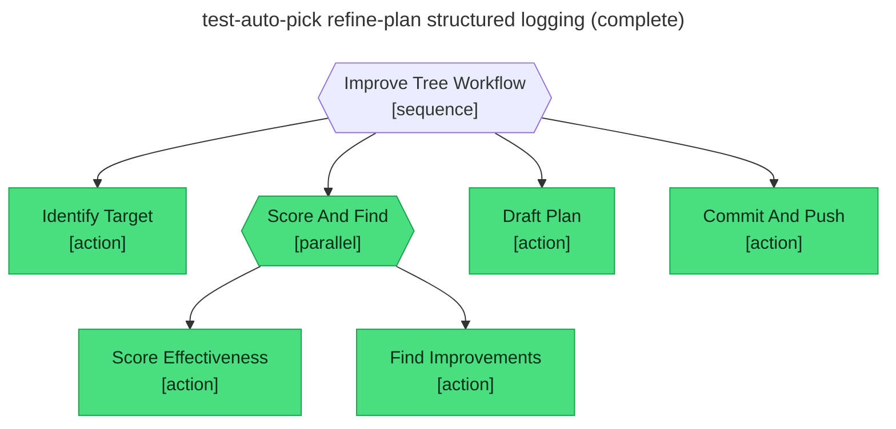

# Test report — Auto-picked most-recent session drives a full pass through scoring, drafting, and push

**Tree:** improve-tree (v1.0.0)
**Runner:** test-tree (v1.2.0, fixture-driven side effects)
**Spec:** .abtree/trees/improve-tree/TEST__happy-path-auto-pick.yaml
**Target execution:** test-auto-pick-refine-plan-structured-lo__improve-tree__1
**Overall:** PASS

## Final $LOCAL

| key | value |
|---|---|
| session_ref | "test-tree-run-structured-logging-happy-p__refine-plan__1" |
| tree_slug | "refine-plan" |
| session_evidence | { nodes_reached: [7], nodes_failed: [], local_keys_null: [draft_path, mr_url], local_keys_populated: [change_request, intent_analysis, plan_path, codeowner_approved] } |
| effectiveness_score | { score: 0.81, observations: [1] } |
| improvements | [add-evaluate Save_Plan draft_path null] |
| plan_path | "plans/2026-05-11-improve-refine-plan.md" |
| commit_sha | "7c2bafc91d3e44a8915f6a3e2c0c7a1d1e8b9f02" |

## Assertions

| Name | Expected | Actual | Pass |
|---|---|---|---|
| status | done | done | ✓ |
| local.session_ref | test-tree-run-structured-logging-happy-p__refine-plan__1 | test-tree-run-structured-logging-happy-p__refine-plan__1 | ✓ |
| local.tree_slug | refine-plan | refine-plan | ✓ |
| local.session_evidence | non-empty | non-empty | ✓ |
| local.effectiveness_score | non-empty | non-empty (score 0.81) | ✓ |
| local.improvements | non-empty | non-empty (1 item) | ✓ |
| local.plan_path | plans/2026-05-11-improve-refine-plan.md | plans/2026-05-11-improve-refine-plan.md | ✓ |
| local.commit_sha | 7c2bafc91d3e44a8915f6a3e2c0c7a1d1e8b9f02 | 7c2bafc91d3e44a8915f6a3e2c0c7a1d1e8b9f02 | ✓ |
| files.plan_path.exists | true | (fixture) true | ✓ |
| files.plan_path.frontmatter.status | draft | (fixture) draft | ✓ |
| git.sha | 7c2bafc91d3e44a8915f6a3e2c0c7a1d1e8b9f02 | (fixture) 7c2bafc91d3e44a8915f6a3e2c0c7a1d1e8b9f02 | ✓ |
| git.pushed | true | (fixture) true | ✓ |

## Trace

