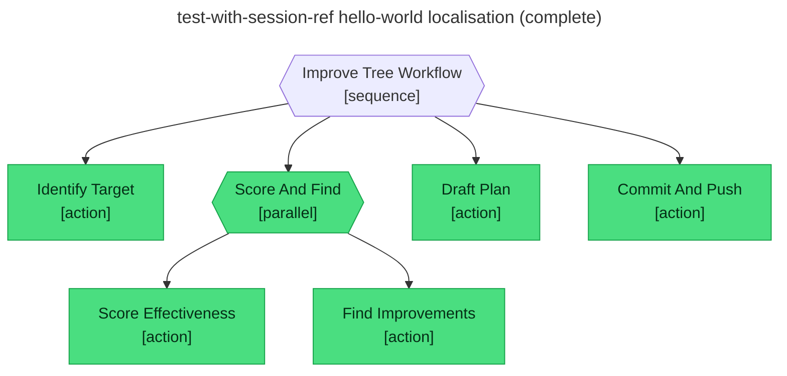

# Test report — Caller-seeded session ref drives a full pass through scoring, drafting, and push

**Tree:** improve-tree (v1.0.0)
**Runner:** test-tree (v1.2.0, fixture-driven side effects)
**Spec:** .abtree/trees/improve-tree/TEST__happy-path-with-session-ref.yaml
**Target execution:** test-with-session-ref-hello-world-locali__improve-tree__1
**Overall:** PASS

## Final $LOCAL

| key | value |
|---|---|
| session_ref | "test-tree-run-localisation-formal-french__hello-world__1" |
| tree_slug | "hello-world" |
| session_evidence | { nodes_reached: [4], nodes_failed: [Morning_Greeting], local_keys_null: [greeting], local_keys_populated: [time_of_day] } |
| effectiveness_score | { score: 0.62, observations: [1] } |
| improvements | [reword Morning_Greeting, add-evaluate Default_Greeting] |
| plan_path | "plans/2026-05-11-improve-hello-world.md" |
| commit_sha | "4a9f1c2bfa7d6e5e93a118b3b2a30a44b1d8e7c1" |

## Assertions

| Name | Expected | Actual | Pass |
|---|---|---|---|
| status | done | done | ✓ |
| local.session_ref | test-tree-run-localisation-formal-french__hello-world__1 | test-tree-run-localisation-formal-french__hello-world__1 | ✓ |
| local.tree_slug | hello-world | hello-world | ✓ |
| local.session_evidence | non-empty | non-empty | ✓ |
| local.effectiveness_score | non-empty | non-empty (score 0.62) | ✓ |
| local.improvements | non-empty | non-empty (2 items) | ✓ |
| local.plan_path | plans/2026-05-11-improve-hello-world.md | plans/2026-05-11-improve-hello-world.md | ✓ |
| local.commit_sha | 4a9f1c2bfa7d6e5e93a118b3b2a30a44b1d8e7c1 | 4a9f1c2bfa7d6e5e93a118b3b2a30a44b1d8e7c1 | ✓ |
| files.plan_path.exists | true | (fixture) true | ✓ |
| files.plan_path.frontmatter.status | draft | (fixture) draft | ✓ |
| git.sha | 4a9f1c2bfa7d6e5e93a118b3b2a30a44b1d8e7c1 | (fixture) 4a9f1c2bfa7d6e5e93a118b3b2a30a44b1d8e7c1 | ✓ |
| git.pushed | true | (fixture) true | ✓ |

## Trace

