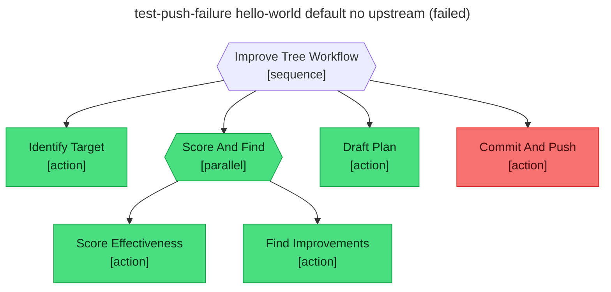

# Test report — Push fails with no upstream — workflow surfaces the error and ends in failure

**Tree:** improve-tree (v1.0.0)
**Runner:** test-tree (v1.2.0, fixture-driven side effects)
**Spec:** .abtree/trees/improve-tree/TEST__push-failure.yaml
**Target execution:** test-push-failure-hello-world-default-no__improve-tree__1
**Overall:** PASS

## Final $LOCAL

| key | value |
|---|---|
| session_ref | "test-tree-run-default-unclassifiable-tim__hello-world__1" |
| tree_slug | "hello-world" |
| session_evidence | { nodes_reached: [4], nodes_failed: [], local_keys_null: [], local_keys_populated: [time_of_day, greeting] } |
| effectiveness_score | { score: 0.78, observations: [] } |
| improvements | [reword Default_Greeting] |
| plan_path | "plans/2026-05-11-improve-hello-world.md" |
| commit_sha | null |

## Assertions

| Name | Expected | Actual | Pass |
|---|---|---|---|
| status | failure | failure | ✓ |
| local.tree_slug | hello-world | hello-world | ✓ |
| local.effectiveness_score | non-empty | non-empty (score 0.78) | ✓ |
| local.improvements | non-empty | non-empty (1 item) | ✓ |
| local.plan_path | plans/2026-05-11-improve-hello-world.md | plans/2026-05-11-improve-hello-world.md | ✓ |
| local.commit_sha | null | null | ✓ |
| files.plan_path.exists | true | (fixture) true | ✓ |
| files.plan_path.frontmatter.status | draft | (fixture) draft | ✓ |
| git.committed_locally | true | (fixture) true | ✓ |
| git.pushed | false | (fixture) false | ✓ |

## Trace

