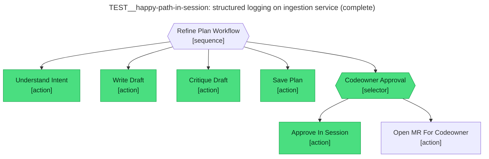

# Test report — Codeowner approves the refined plan inside the session

**Tree:** refine-plan
**Spec:** .abtree/trees/refine-plan/TEST__happy-path-in-session.yaml
**Target execution:** test-happy-path-in-session-structured-lo__refine-plan__1
**Overall:** FAIL

## Final $LOCAL

| key | value |
|---|---|
| change_request | "Add structured logging to the ingestion service so we can correlate request traces in Grafana." |
| intent_analysis | "Ask: feature — add structured (JSON) logging…\nSystems/files: request/handler layer, logging utility, Grafana datasource config.\nConstraints: preserve existing log levels; trace_id must propagate; no PII.\nCodeowners: no CODEOWNERS file in repo — defaults to repo owner.\nAcceptance: every ingestion log line emits JSON with trace_id; Grafana can filter; tests pass." |
| draft_path | "plans/drafts/test-happy-path-in-session-structured-lo__refine-plan__1.md" |
| plan_path | "plans/structured-logging-for-the-ingestion-service.md" |
| codeowner_approved | true |
| mr_url | null |

## Assertions

| Name | Expected | Actual | Pass |
|---|---|---|---|
| status | done | done | ✓ |
| local.change_request | non-empty | non-empty (94 chars) | ✓ |
| local.intent_analysis | non-empty terse bullets | non-empty (5 bullets) | ✓ |
| local.draft_path | null (draft moved by Save_Plan) | "plans/drafts/test-happy-path-…__refine-plan__1.md" (stale; file no longer at this path) | ✗ |
| local.plan_path | matches `plans/.+\.md` | "plans/structured-logging-for-the-ingestion-service.md" | ✓ |
| local.codeowner_approved | true | true | ✓ |
| local.mr_url | null | null | ✓ |
| files.plan_path.exists | true | true | ✓ |
| files.plan_path.frontmatter.status | refined | refined | ✓ |
| files.plan_path.frontmatter.reviewed_by | non-empty (CODEOWNERS id) | "Jonathan Turnock" | ✓ |

**Failure note:** `local.draft_path` was not cleared by Save_Plan in this run.
The tree at `refine-plan@4.1.0` only described the staleness in narration;
it did not instruct an explicit null-out. Subsequent fix bumped the tree to
`refine-plan@4.2.0` with an explicit "then write null to $LOCAL.draft_path"
clause — re-running this spec against the new tree version should turn this
assertion green.

## Trace

