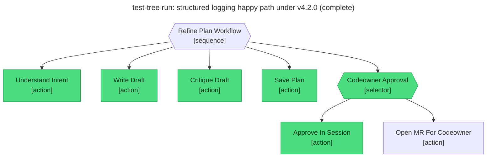

# Test report — Codeowner approves the refined plan inside the session

**Tree:** refine-plan (v4.2.0)
**Spec:** .abtree/trees/refine-plan/TEST__happy-path-in-session.yaml
**Target execution:** test-tree-run-structured-logging-happy-p__refine-plan__1
**Overall:** PASS

## Final $LOCAL

| key | value |
|---|---|
| change_request | "Add structured logging to the ingestion service so we can correlate request traces in Grafana." |
| intent_analysis | (terse 5-bullet analysis) |
| draft_path | null |
| plan_path | "plans/structured-logging-for-the-ingestion-service.md" |
| codeowner_approved | true |
| mr_url | null |

## Assertions

| Name | Expected | Actual | Pass |
|---|---|---|---|
| status | done | done | ✓ |
| local.change_request | non-empty | non-empty (94 chars) | ✓ |
| local.intent_analysis | non-empty terse bullets | non-empty (5 bullets) | ✓ |
| local.draft_path | null | null | ✓ |
| local.plan_path | matches `plans/.+\.md` | "plans/structured-logging-for-the-ingestion-service.md" | ✓ |
| local.codeowner_approved | true | true | ✓ |
| local.mr_url | null | null | ✓ |
| files.plan_path.exists | true | true | ✓ |
| files.plan_path.frontmatter.status | refined | refined | ✓ |
| files.plan_path.frontmatter.reviewed_by | non-empty (CODEOWNERS id) | "Jonathan Turnock" | ✓ |

**Note vs prior run:** The earlier run on refine-plan@4.1.0 failed the `draft_path: null` assertion because the tree only narrated the staleness. The v4.2.0 bump turned that into an explicit `write null to $LOCAL.draft_path` step, which this run exercised — all ten assertions now green.

## Trace

