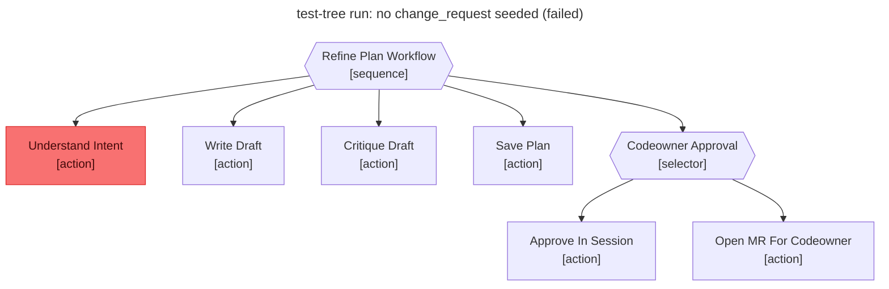

# Test report — No change_request seeded → workflow fails at the Understand_Intent gate

**Tree:** refine-plan
**Spec:** .abtree/trees/refine-plan/TEST__missing-change-request.yaml
**Target execution:** test-tree-run-no-change-request-seeded__refine-plan__1
**Overall:** PASS

## Final $LOCAL

| key | value |
|---|---|
| change_request | null |
| intent_analysis | null |
| draft_path | null |
| plan_path | null |
| codeowner_approved | null |
| mr_url | null |

## Assertions

| Name | Expected | Actual | Pass |
|---|---|---|---|
| status | failure | failure | ✓ |
| local.change_request | null | null | ✓ |
| local.intent_analysis | null | null | ✓ |
| local.draft_path | null | null | ✓ |
| local.plan_path | null | null | ✓ |
| local.codeowner_approved | null | null | ✓ |
| local.mr_url | null | null | ✓ |
| files.plans_drafts_dir.contains_files_for_this_execution | false | false (no draft was written; Write_Draft never fired) | ✓ |

## Trace

