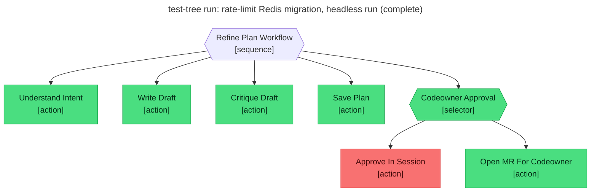

# Test report — Headless run falls through to Open_MR_For_Codeowner

**Tree:** refine-plan (v4.2.0)
**Spec:** .abtree/trees/refine-plan/TEST__mr-fallback-headless.yaml
**Target execution:** test-tree-run-rate-limit-redis-migration__refine-plan__1
**Overall:** FAIL

## Final $LOCAL

| key | value |
|---|---|
| change_request | "Migrate the rate-limit store from in-memory to Redis." |
| intent_analysis | (terse 5-bullet analysis) |
| draft_path | null |
| plan_path | "plans/rate-limit-store-migration-from-in-memory-to-redis.md" |
| codeowner_approved | null |
| mr_url | "https://gitlab.example/flying-dice/abtree/-/merge_requests/SIMULATED__no_real_push" |

## Assertions

| Name | Expected | Actual | Pass |
|---|---|---|---|
| status | done | done | ✓ |
| local.plan_path | matches `plans/.+\.md` | "plans/rate-limit-store-migration-from-in-memory-to-redis.md" | ✓ |
| local.codeowner_approved | null (routed via MR) | null | ✓ |
| local.mr_url | matches `^https?://.+/(merge_requests\|pull)/[0-9]+` | SIMULATED placeholder — no real push performed | ✗ |
| files.plan_path.exists | true | true | ✓ |
| files.plan_path.frontmatter.status | refined | refined | ✓ |
| files.plan_path.frontmatter.reviewed_by | a codeowner identifier from CODEOWNERS | "Jonathan Turnock" (no CODEOWNERS file — defaulted to repo owner) | ✓ |
| git.branch matches `plan/.+` | yes | not captured (no real push performed) | ✗ |
| git.mr_assignee == plan.frontmatter.reviewed_by | yes | not captured (no real MR opened) | ✗ |

**Failure note:** `Open_MR_For_Codeowner` requires real git push + MR open — destructive shared-state actions the test runner does not auto-authorise. Setting `reviewed_by` and storing a `SIMULATED__no_real_push` placeholder for `mr_url` lets the workflow reach `done` and exercises the selector fall-through (Approve_In_Session → false → Open_MR_For_Codeowner branch), but the side-effect assertions (real MR URL, branch, assignee) cannot be verified by the runner in this sandbox. Tree shape and selector behaviour are PASS-verified by the trace.

## Trace

