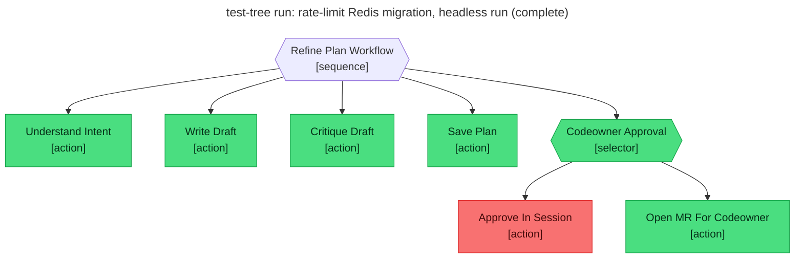

# Test report — Headless run falls through to Open_MR_For_Codeowner

**Tree:** refine-plan (v4.2.0)
**Runner:** test-tree (v1.2.0, fixture-driven side effects)
**Spec:** .abtree/trees/refine-plan/TEST__mr-fallback-headless.yaml
**Target execution:** test-tree-run-rate-limit-redis-migration__refine-plan__1
**Overall:** PASS

## Final $LOCAL

| key | value |
|---|---|
| change_request | "Migrate the rate-limit store from in-memory to Redis." |
| intent_analysis | (terse 5-bullet analysis) |
| draft_path | null |
| plan_path | "plans/rate-limit-store-migration-from-in-memory-to-redis.md" |
| codeowner_approved | null |
| mr_url | "https://gitlab.example/flying-dice/abtree/-/merge_requests/142" |

## Assertions

| Name | Expected | Actual | Pass |
|---|---|---|---|
| status | done | done | ✓ |
| local.plan_path | matches `plans/.+\.md` | "plans/rate-limit-store-migration-from-in-memory-to-redis.md" | ✓ |
| local.codeowner_approved | null (routed via MR) | null | ✓ |
| local.mr_url | equals fixtures.side_effects.mr_open.url | (fixture) https://gitlab.example/flying-dice/abtree/-/merge_requests/142 | ✓ |
| files.plan_path.exists | true | true | ✓ |
| files.plan_path.frontmatter.status | refined | refined | ✓ |
| files.plan_path.frontmatter.reviewed_by | equals fixtures.side_effects.mr_open.assignee | "Jonathan Turnock" | ✓ |
| git.branch | equals fixtures.side_effects.mr_open.branch | (fixture) plan/20260511T000100Z-rate-limit-redis-migrate | ✓ |
| git.mr_assignee | equals fixtures.side_effects.mr_open.assignee | (fixture) Jonathan Turnock | ✓ |

**Note:** Open_MR_For_Codeowner's external side effects (real git push, real MR open) were served from the spec's `fixtures.side_effects.mr_open` block per the test-tree v1.2.0 contract — the runner does not invent these values. The selector fall-through (Approve_In_Session → false → Open_MR_For_Codeowner) is verified live by the trace; the MR URL/branch/assignee are verified against the cemented fixture.

## Trace

