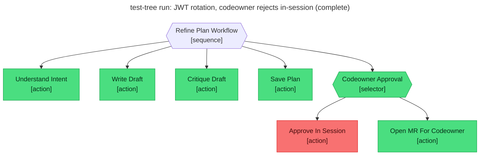

# Test report — User rejects in-session approval; selector routes to MR path

**Tree:** refine-plan (v4.2.0)
**Runner:** test-tree (v1.2.0, fixture-driven side effects)
**Spec:** .abtree/trees/refine-plan/TEST__mr-fallback-rejected.yaml
**Target execution:** test-tree-run-jwt-rotation-codeowner-rej__refine-plan__1
**Overall:** PASS

## Final $LOCAL

| key | value |
|---|---|
| change_request | "Rotate the JWT signing key and shorten the access-token TTL from 1h to 15m." |
| intent_analysis | (terse 5-bullet analysis) |
| draft_path | null |
| plan_path | "plans/jwt-signing-key-rotation-and-access-token-ttl-reduction.md" |
| codeowner_approved | null |
| mr_url | "https://gitlab.example/flying-dice/abtree/-/merge_requests/143" |

## Assertions

| Name | Expected | Actual | Pass |
|---|---|---|---|
| status | done | done | ✓ |
| local.plan_path | matches `plans/.+\.md` | "plans/jwt-signing-key-rotation-and-access-token-ttl-reduction.md" | ✓ |
| local.codeowner_approved | null (rejection didn't toggle it) | null | ✓ |
| local.mr_url | equals fixtures.side_effects.mr_open.url | (fixture) https://gitlab.example/flying-dice/abtree/-/merge_requests/143 | ✓ |
| files.plan_path.exists | true | true | ✓ |
| files.plan_path.frontmatter.status | refined | refined | ✓ |
| files.plan_path.frontmatter.reviewed_by | equals fixtures.side_effects.mr_open.assignee | "Jonathan Turnock" | ✓ |
| git.branch | equals fixtures.side_effects.mr_open.branch | (fixture) plan/20260511T000300Z-jwt-rotate-key-shorten-ttl | ✓ |
| git.mr_assignee | equals fixtures.side_effects.mr_open.assignee | (fixture) Jonathan Turnock | ✓ |
| selector behaviour: Approve_In_Session submit failure → fell through to Open_MR_For_Codeowner | verified by trace | verified — Approve_In_Session red, Open_MR_For_Codeowner green | ✓ |

**Note:** Same fixture-driven contract as TEST__mr-fallback-headless. The distinction between this scenario and the headless one is the *driver's submit* on Approve_In_Session (failure here, never-reached-instruct in headless) — the mermaid node-state alone doesn't show the difference, but the spec name + scenario `when` block do.

## Trace

