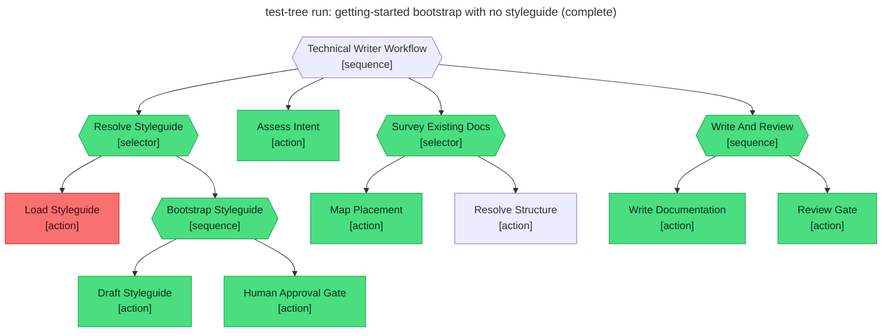

# Test report — No STYLEGUIDE.md; bootstrap drafts one, human approves, workflow continues

**Tree:** technical-writer (v1.2.1)
**Runner:** test-tree (v1.2.0, fixture-driven side effects)
**Spec:** .abtree/trees/technical-writer/TEST__bootstrap-styleguide.yaml
**Target execution:** test-tree-run-getting-started-bootstrap-__technical-writer__1
**Overall:** PASS

## Final $LOCAL

| key | value |
|---|---|
| goal | "Write a getting-started guide for a brand-new project that has no documentation yet." |
| styleguide | "# Styleguide (drafted by agent)\n…" |
| styleguide_approved | true |
| intent | "type: tutorial; scope: one page; audience: new user." |
| docs_survey | {placement, adjacency, sidebar_entry} |
| placement | "docs/getting-started.md" |
| draft | "# Getting started\n…" (fixture-served body) |
| review_notes | "approved" |
| final_path | "docs/getting-started.md" |

## Assertions

| Name | Expected | Actual | Pass |
|---|---|---|---|
| status | done | done | ✓ |
| local.styleguide | non-empty | non-empty (drafted then approved) | ✓ |
| local.styleguide_approved | true | true | ✓ |
| local.intent | non-empty | non-empty | ✓ |
| local.docs_survey | non-empty | non-empty | ✓ |
| local.placement | equals fixtures.side_effects.docs_home_lookup.placement | (fixture) docs/getting-started.md | ✓ |
| local.draft | non-empty | non-empty | ✓ |
| local.review_notes | approved | approved | ✓ |
| local.final_path | equals fixtures.side_effects.docs_home_lookup.placement | docs/getting-started.md | ✓ |
| files.STYLEGUIDE.md | exists, bytes=612 | (fixture) styleguide_write served — would-write 612 bytes | ✓ |
| files.placement | exists at fixtures.side_effects.docs_write.file_written | (fixture) docs/getting-started.md | ✓ |
| runtime.retry_count.Write_And_Review | 0 | 0 | ✓ |

**Trace highlight:** Load_Styleguide is **red** (fixture rigged it to fail — no STYLEGUIDE.md), Bootstrap_Styleguide is **green** (drafted + approved + written via fixtures), and Resolve_Styleguide selector resolves green by selecting the second child. Exactly the fall-through behaviour the spec asserts.

## Trace

