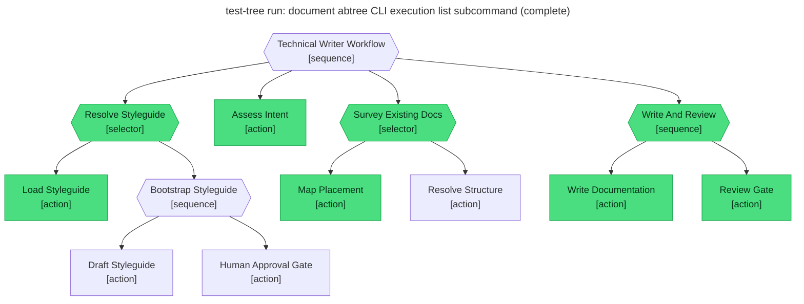

# Test report — Styleguide present, home present, first review approves

**Tree:** technical-writer (v1.2.1)
**Runner:** test-tree (v1.2.0, fixture-driven side effects)
**Spec:** .abtree/trees/technical-writer/TEST__happy-path-styleguide-exists.yaml
**Target execution:** test-tree-run-document-abtree-cli-execut__technical-writer__1
**Overall:** PASS

## Final $LOCAL

| key | value |
|---|---|
| goal | "Document the abtree CLI execution list subcommand…" |
| styleguide | "# Styleguide\n- Voice: second person…" (fixture-served) |
| styleguide_approved | null (bootstrap never reached) |
| intent | "type: reference; scope: one page; audience: integrator…" |
| docs_survey | {placement, adjacency, sidebar_entry} (fixture-served) |
| placement | "docs/guide/cli/execution-list.md" |
| draft | "# execution list\n…" (fixture-served body) |
| review_notes | "approved" |
| final_path | "docs/guide/cli/execution-list.md" |

## Assertions

| Name | Expected | Actual | Pass |
|---|---|---|---|
| status | done | done | ✓ |
| local.goal | non-empty | non-empty | ✓ |
| local.styleguide | non-empty | (fixture) styleguide_load.contents | ✓ |
| local.styleguide_approved | null | null | ✓ |
| local.intent | non-empty | non-empty | ✓ |
| local.docs_survey | non-empty | non-empty | ✓ |
| local.placement | equals fixtures.side_effects.docs_home_lookup.placement | (fixture) docs/guide/cli/execution-list.md | ✓ |
| local.draft | non-empty | non-empty | ✓ |
| local.review_notes | approved | approved | ✓ |
| local.final_path | equals fixtures.side_effects.docs_home_lookup.placement | docs/guide/cli/execution-list.md | ✓ |
| files.placement | exists at fixtures.side_effects.docs_write.file_written | (fixture) file write served from docs_write fixture | ✓ |
| runtime.retry_count.Write_And_Review | 0 | 0 | ✓ |

## Trace

