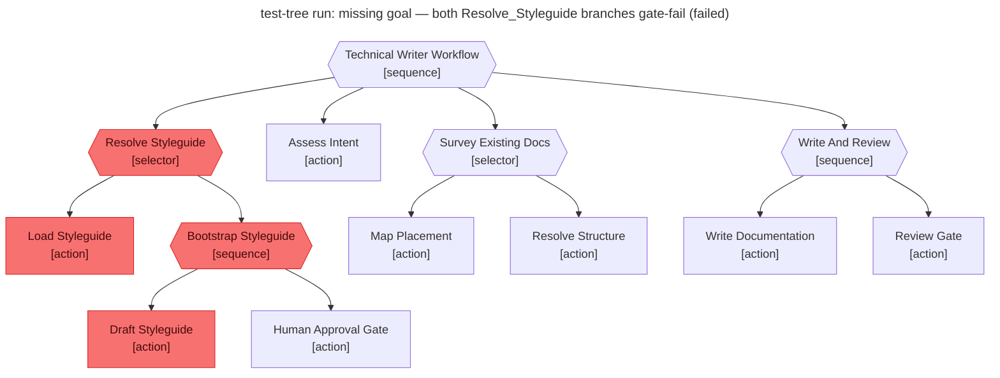

# Test report — No goal seeded → Resolve_Styleguide selector exhausts both branches and the workflow fails

**Tree:** technical-writer (v1.2.1)
**Runner:** test-tree (v1.2.0, fixture-driven side effects)
**Spec:** .abtree/trees/technical-writer/TEST__missing-goal.yaml
**Target execution:** test-tree-run-missing-goal-both-resolve-__technical-writer__1
**Overall:** PASS

## Final $LOCAL

| key | value |
|---|---|
| goal | null |
| styleguide | null |
| styleguide_approved | null |
| intent | null |
| docs_survey | null |
| placement | null |
| draft | null |
| review_notes | null |
| final_path | null |

## Assertions

| Name | Expected | Actual | Pass |
|---|---|---|---|
| status | failure | failure | ✓ |
| local.goal | null | null | ✓ |
| local.styleguide | null | null | ✓ |
| local.styleguide_approved | null | null | ✓ |
| local.intent | null | null | ✓ |
| local.docs_survey | null | null | ✓ |
| local.placement | null | null | ✓ |
| local.draft | null | null | ✓ |
| local.review_notes | null | null | ✓ |
| local.final_path | null | null | ✓ |
| files.STYLEGUIDE.md.modified_during_run | false | false (bootstrap never wrote) | ✓ |
| runtime.retry_count.Write_And_Review | 0 | 0 | ✓ |

**Trace highlight:** Both Load_Styleguide and Bootstrap_Styleguide are red, so Resolve_Styleguide is red, the parent sequence aborts on the first failing child, and the downstream nodes (Assess_Intent, Survey_Existing_Docs, Write_And_Review) are never visited. Exactly the gate behaviour the spec asserts.

## Trace

