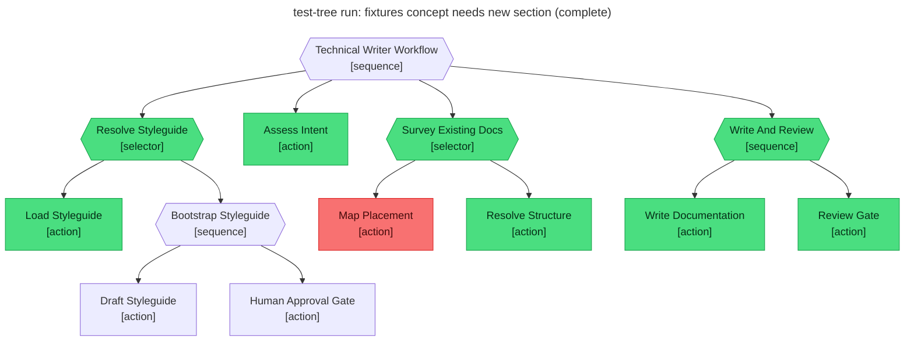

# Test report — No home in docs tree; Resolve_Structure creates a new section first

**Tree:** technical-writer (v1.2.1)
**Runner:** test-tree (v1.2.0, fixture-driven side effects)
**Spec:** .abtree/trees/technical-writer/TEST__no-home-resolve-structure.yaml
**Target execution:** test-tree-run-fixtures-concept-needs-new__technical-writer__1
**Overall:** PASS

## Final $LOCAL

| key | value |
|---|---|
| goal | "Document the brand-new behaviour-tree-fixtures concept." |
| styleguide | "# Styleguide\n…" (loaded — real file present) |
| intent | "type: conceptual explainer; scope: one section; audience: integrator." |
| docs_survey | {new_section, sidebar_patch} (fixture-served) |
| placement | "docs/concepts/fixtures/index.md" |
| draft | "# Fixtures\n…" (fixture-served body) |
| review_notes | "approved" |
| final_path | "docs/concepts/fixtures/index.md" |

## Assertions

| Name | Expected | Actual | Pass |
|---|---|---|---|
| status | done | done | ✓ |
| local.placement | equals fixtures.side_effects.docs_structural_change.placement | (fixture) docs/concepts/fixtures/index.md | ✓ |
| local.draft | non-empty | non-empty | ✓ |
| local.review_notes | approved | approved | ✓ |
| local.final_path | equals fixtures.side_effects.docs_structural_change.placement | docs/concepts/fixtures/index.md | ✓ |
| files.placement | exists at fixtures.side_effects.docs_write.file_written | (fixture) docs/concepts/fixtures/index.md | ✓ |
| files.sidebar | contains fixtures.side_effects.docs_structural_change.created.sidebar_patch.new_entry | (fixture) docs/.vitepress/config.ts patched with {text: Fixtures, link: /concepts/fixtures/} | ✓ |
| runtime.retry_count.Write_And_Review | 0 | 0 | ✓ |

**Trace highlight:** Map_Placement is **red** (fixture rigged "home_exists: false"), Resolve_Structure is **green**, and Survey_Existing_Docs selector resolves green via fall-through to the second child.

## Trace

