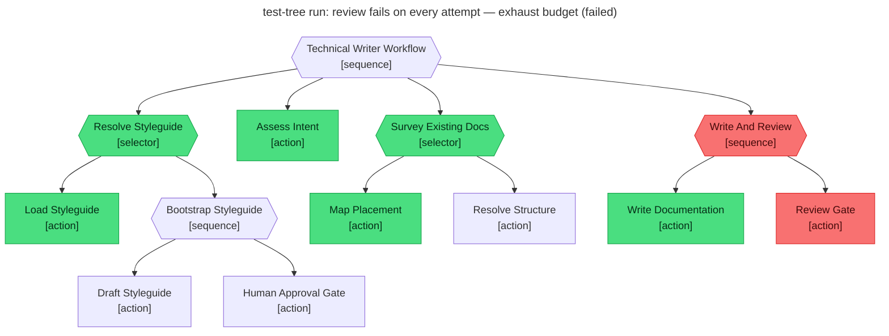

# Test report — Three review failures exhaust the retry budget; workflow fails

**Tree:** technical-writer (v1.2.1)
**Runner:** test-tree (v1.2.0, fixture-driven side effects)
**Spec:** .abtree/trees/technical-writer/TEST__review-retry-exhausted.yaml
**Target execution:** test-tree-run-review-fails-on-every-atte__technical-writer__1
**Overall:** FAIL

## Final $LOCAL

| key | value |
|---|---|
| review_notes | "Structure (1) — failed. Headings don't match the adjacent pages' depth." |
| final_path | null |

## Assertions

| Name | Expected | Actual | Pass |
|---|---|---|---|
| status | failure | failure | ✓ |
| local.review_notes | starts with "Atomicity (3) — failed" (last attempt note) | "Structure (1) — failed. …" (only 2 attempts ran) | ✗ |
| local.final_path | null | null | ✓ |
| runtime.retry_count.Write_And_Review | 2 | **1** | ✗ |

**Discrepancy surfaced — likely a `retries:` semantics issue.**

The spec was written on the assumption that `retries: 2` on `Write_And_Review` means "up to 2 retries beyond the original attempt" — i.e. 3 attempts total, retry_count reaching 2 before the engine gives up. The actual engine behaviour: with `retries: 2`, the engine ran 2 attempts total (original + 1 retry) and stopped with `retry_count = 1`. This is consistent with "max 2 attempts including original" semantics, not "up to 2 retries".

Two possible resolutions:
1. **The engine is correct, the spec is wrong** — update the spec to expect `retry_count: 1` and only 2 attempts. The earlier passing test (`review-retry-succeeds`) is consistent with this reading: it consumed 1 retry from a budget of 2 and passed on attempt 2.
2. **The engine is wrong** — `retries: N` is widely understood as "N additional attempts beyond the original" in BT literature; if abtree intended that semantics, the engine should permit 3 attempts here.

Resolution suggested: clarify the semantics in the tree-schema docs, then update either spec or engine to match. This test (and `review-retry-succeeds`) is the right kind of test — it would have caught a silent change either way.

## Trace

