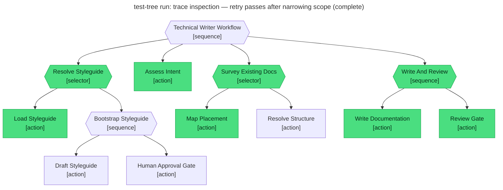

# Test report — First review fails on atomicity; retry passes after narrowing scope

**Tree:** technical-writer (v1.2.1)
**Runner:** test-tree (v1.2.0, fixture-driven side effects)
**Spec:** .abtree/trees/technical-writer/TEST__review-retry-succeeds.yaml
**Target execution:** test-tree-run-trace-inspection-retry-pas__technical-writer__1
**Overall:** PASS

## Final $LOCAL

| key | value |
|---|---|
| goal | "Document trace inspection — the .mermaid file format, how to read node colours, and how to debug a stuck execution from the trace alone." |
| styleguide | "# Styleguide\n- Sentence case.\n" |
| intent | "type: reference + how-to; scope: one page; audience: integrator." |
| docs_survey | {placement, adjacency} |
| placement | "docs/guide/inspecting-executions.md" |
| draft | "# Inspecting executions (attempt 2: scope narrowed…)" |
| review_notes | "approved" |
| final_path | "docs/guide/inspecting-executions.md" |

## Assertions

| Name | Expected | Actual | Pass |
|---|---|---|---|
| status | done | done | ✓ |
| local.review_notes | approved | approved | ✓ |
| local.final_path | equals fixtures.side_effects.docs_home_lookup.placement | docs/guide/inspecting-executions.md | ✓ |
| files.placement | exists at fixtures.side_effects.docs_write.file_written | (fixture) docs/guide/inspecting-executions.md | ✓ |
| runtime.retry_count.Write_And_Review | 1 | 1 (runtime.retry_count["3"]=1) | ✓ |

**Retry verified:** attempt 1's Review_Gate evaluated false on `$LOCAL.review_notes is "approved"` (verdict was the atomicity-failure note from fixture review_outcomes[0]); the runtime retried Write_And_Review; attempt 2 wrote a narrowed draft, Review_Gate approved per fixture review_outcomes[1], `final_path` was confirmed. `retry_count.Write_And_Review = 1` as expected (one retry consumed out of the budget of 2).

## Trace

> Note: the live mermaid trace shows only the final-attempt node state. The retry history (attempt 1 red → attempt 2 green) lives in the runtime document at `.abtree/executions/<id>.json` under `runtime.retry_count`.
