<p align="center">
  
</p>

<h1 align="center">abtree</h1>

<p align="center">
  <strong><s>Hoping.</s> Behaving.</strong><br/>
  Treat agent instructions like the software they are. Clear steps, predictable behavior, real answers when something goes wrong.
</p>

<p align="center">
  <a href="https://abtree.sh">Docs</a> ·
  <a href="https://abtree.sh/getting-started">Get started</a> ·
  <a href="https://abtree.sh/concepts/">How it works</a>
</p>

---

## What it does

abtree is a runtime for agent workflows. Author a tree as JSON, YAML, or compile it from the TypeScript DSL. Ship it through any transport your team already uses — abtree never sees the distribution; it only reads the file at the path you point it at. Your agent drives execution through three commands (`next`, `eval`, `submit`) and only ever sees the next step.



The trace above is a `Refactor_Loop` sequence with three actions. Green nodes ran and succeeded, red ran and failed, the pink ring marks the cursor. The runtime regenerates the diagram after every state change, so what the agent did and what it skipped is on disk by the time it finishes.

## Install

**macOS / Linux**

```sh
curl -fsSL https://github.com/flying-dice/abtree/releases/latest/download/install.sh | sh
```

**Windows (PowerShell)**

```powershell
irm https://github.com/flying-dice/abtree/releases/latest/download/install.ps1 | iex
```

## Read the docs

Concepts, guides, CLI reference, and a five-minute walkthrough all live at **[abtree.sh](https://abtree.sh)**.

→ [**Get started in five minutes**](https://abtree.sh/getting-started)
