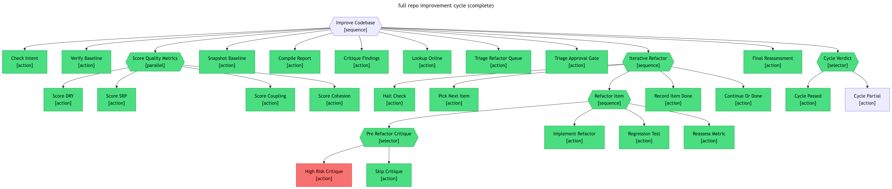

<p align="center">
  
</p>

<h1 align="center">abtree</h1>

<p align="center">
  <strong>Behaviour trees for AI agents.</strong><br/>
  Define agent workflows as YAML. The runtime hands the agent one step at a time, verifies the result, and persists the cursor — so workflows stay reproducible no matter how big they get.
</p>

<p align="center">
  <a href="https://abtree.sh">Docs</a> ·
  <a href="https://abtree.sh/getting-started">Get started</a> ·
  <a href="https://abtree.sh/concepts/">Why behaviour trees?</a>
</p>

---

## Install

**macOS / Linux**

```sh
curl -fsSL https://github.com/flying-dice/abtree/releases/latest/download/install.sh | sh
```

**Windows (PowerShell)**

```powershell
irm https://github.com/flying-dice/abtree/releases/latest/download/install.ps1 | iex
```

## What it is

abtree is a CLI that turns a YAML tree into a deterministic, durable agent workflow. Your agent drives execution through three commands — `next`, `eval`, `submit` — and only ever sees the next step. State persists as JSON; every state change regenerates a Mermaid trace so you can see exactly what ran, what passed, and what was bypassed.



## Read the docs

Concepts, guides, agent integration, CLI reference, and examples all live at **[abtree.sh](https://abtree.sh)**.

→ [**Get started in five minutes**](https://abtree.sh/getting-started)
