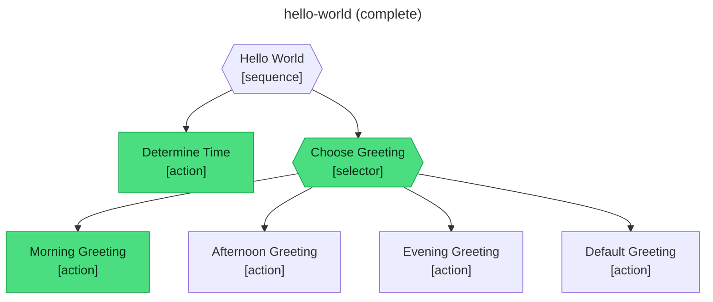

# abtree

Abtree is an agentic, progressively disclosed behavioural tree toolkit. Create expressive behaviour trees to steer your agents with coarse or fine instructions. abtree aims to bring the structural reliability of robotics and AAA game AI to the agentic stack, giving you deterministic control over simple and complex workflows.

**One CLI to Rule the Workflow**

- **Agent-First Design:** Native CLI built for your agent. Every command outputs JSON.
- **Durable Execution:** Resumable executions that persist as per-execution JSON documents.
- **Progressive Disclosure:** Agents only see the next step when they reach it, eliminating "instruction fatigue."
- **Platform Agnostic:** Works seamlessly with any agentic framework or platform.

## What’s different about behaviour trees?

While modern LLMs are capable of following Markdown-based instructions, two fundamental issues often emerge. **Instruction Fatigue** and **Non-Determinism**. When instructions become too dense, agents lose focus, when decision-making is left entirely to the model, workflows can feel random.

Behaviour Trees solve this by providing a formal logic layer. Long used in video games and robotics to manage complex AI actors, they provide a modular way to build tasks that are both scalable and predictable.

## The 3 core elements of a tree

abtree strips away the complexity of BTs to focus on three functional components: **State**, **Branches**, and **Actions**.

### 1. State

All behaviour trees are stateful by design. Instead of leaving agents relying on a shifting conversation window, abtree separates and manages state in two distinct scopes:

- **Local ($LOCAL):** The internal workflow state. These are variable containers for data generated during the run (e.g., a generated ID or a confidence score).
- **World ($GLOBAL):** The external environment. These are instructions on how the agent should observe or query the current environment (e.g., checking a database or reading a sensor). You do not "set" world state; you observe its reality.

### 2. Branches

Branches define the flow of execution. They allow you to model complex logic through simple parent-child relationships:

- **Sequence:** Executes children in order. If any child fails, the sequence aborts. This is used for linear dependencies.
- **Selector:** Executes children until one succeeds. This is the primary tool for fallback logic and decision-making.
- **Parallel:** Executes all children simultaneously. If any child fails, the entire branch is considered failed.

### 3. Actions

Actions are the "leaves" of the tree — the actual work being done. Every action in abtree consists of two parts:

- **Instruction:** The specific task for the agent to perform.
- **Evaluate:** An invariant rule that must be met for the action to succeed. Success is not "guessed"; it is verified against this rule.

By using this hierarchy, the result of every action propagates up the tree. This ensures that an agent cannot move to a "Goodbye" step if a "Quality" step failed to meet its invariant. Lets see it in action:

```yaml
name: hello-world
version: 2.0.0
description: Greet a user based on time of day. Demonstrates sequence, selector, and action primitives.

state:
  local:
    time_of_day: null
    greeting: null
  global:
    user_name: retrieve by running the shell command "whoami"
    tone: friendly
    language: english

tree:
  type: sequence
  name: Hello_World
  children:
    - type: action
      name: Determine_Time
      steps:
        - instruct: >
            Check the system clock to get the current hour.
            Classify as: before 12:00 = "morning", 12:00-17:00 = "afternoon", after 17:00 = "evening".
            Store the classification string at $LOCAL.time_of_day.

    - type: selector
      name: Choose_Greeting
      children:
        - type: action
          name: Morning_Greeting
          steps:
            - evaluate: $LOCAL.time_of_day is "morning"
            - instruct: >
                Compose a cheerful morning greeting addressing $GLOBAL.user_name
                in $GLOBAL.language with a $GLOBAL.tone tone.
                Store at $LOCAL.greeting.

        - type: action
          name: Afternoon_Greeting
          steps:
            - evaluate: $LOCAL.time_of_day is "afternoon"
            - instruct: >
                Compose a warm afternoon greeting addressing $GLOBAL.user_name
                in $GLOBAL.language with a $GLOBAL.tone tone.
                Store at $LOCAL.greeting.

        - type: action
          name: Evening_Greeting
          steps:
            - evaluate: $LOCAL.time_of_day is "evening"
            - instruct: >
                Compose a relaxed evening greeting addressing $GLOBAL.user_name
                in $GLOBAL.language with a $GLOBAL.tone tone.
                Store at $LOCAL.greeting.

        - type: action
          name: Default_Greeting
          steps:
            - instruct: >
                Compose a neutral greeting addressing $GLOBAL.user_name
                in $GLOBAL.language with a $GLOBAL.tone tone.
                Store at $LOCAL.greeting.
```

The YAML defines the structure. At runtime, abtree generates a live execution diagram after every state change — nodes colour green on success, red on failure, grey when bypassed. Here's the `hello-world` tree (included in `.abtree/trees/`) after a complete run. The selector chose Morning Greeting and stopped — the afternoon, evening, and default branches were never entered. Every node reached is green.



Sitting as a separate coordination layer, **abtree** functions as the structural backbone for agentic sessions, distinct from standard prompts or skills. It operates via a YAML spec and a CLI that enforces a strict "start at the root" protocol, progressively disclosing instructions only after the agent satisfies specific evaluation invariants. This keeps the LLM on rails by preventing instruction fatigue and "jumping ahead," while per-execution JSON documents snapshot the workflow and persist state. The result is a durable execution environment where trees can grow to unbounded size, allowing for granular control and predictable resumption across sessions.

## Installation

**macOS / Linux**

```sh
curl -fsSL https://github.com/flying-dice/abtree/releases/latest/download/install.sh | sh
```

Installs `abtree` to `~/.local/bin`. To install system-wide instead, set `INSTALL_DIR`:

```sh
INSTALL_DIR=/usr/local/bin curl -fsSL https://github.com/flying-dice/abtree/releases/latest/download/install.sh | sh
```

**Windows (PowerShell)**

```powershell
irm https://github.com/flying-dice/abtree/releases/latest/download/install.ps1 | iex
```

Installs `abtree.exe` to `~\.local\bin` and adds it to your user `PATH`.

## Upgrading

```sh
abtree upgrade
```

Upgrades abtree in-place to the latest GitHub release. The binary is replaced atomically; the old version is never left in a partially-written state.

| Flag | Description |
|------|-------------|
| `--check` | Print current and latest versions without installing. |
| `--version <tag>` | Install a specific release tag (e.g. `v1.2.3`). |
| `--yes` | Skip the confirmation prompt (useful in scripts). |

If the install directory is not writable, abtree exits immediately with a `sudo mv` hint rather than wasting a network round-trip.

## Usage

```sh
# List available trees
abtree tree list

# Create a new execution
abtree execution create <tree> <summary>

# Write initial state
abtree local write <execution-id> <key> "<value>"

# Drive the execution loop
abtree next <execution-id>          # get next step (evaluate or instruct)
abtree eval <execution-id> true     # submit evaluation result
abtree submit <execution-id> success  # submit instruction outcome

# Inspect an execution
abtree execution get <execution-id>
abtree local read <execution-id>
```

Run `abtree --help` for the full execution protocol.

## Example trees

Ready-to-use trees are included in [`.abtree/trees/`](.abtree/trees/):

| Tree | Description |
|------|-------------|
| [hello-world](.abtree/trees/hello-world/TREE.yaml) | Greet a user based on time of day. Demonstrates sequence, selector, and action primitives. |
| [refine-plan](.abtree/trees/refine-plan/TREE.yaml) | Turn a change request into an approved plan through iterative critique. |
| [implement](.abtree/trees/implement/TREE.yaml) | Implement a feature from an approved spec with structured execution steps. |
| [technical-writer](.abtree/trees/technical-writer/TREE.yaml) | Document a topic with a styleguide gate, three review checks, and bounded retries. |
| [improve-codebase](.abtree/trees/improve-codebase/TREE.yaml) | Continuous code-quality improvement cycle with parallel scoring, human-approved triage and bounded refactor attempts. |

## Explore the ecosystem
* **Workflow-Builder Skill:** Use this skill to help your agent collaboratively design and iterate on new tree specs.
* **Workflow-Runner Skill:** Equip your agent with the ability to navigate trees, persist state, and enforce invariants across sessions.

**Don't leave your agent's success to chance.** Use the proven logic of behavior trees to build reliable, resumable workflows.

**On the Roadmap: Dynamic Planning & Utility Scoring**
While **abtree** currently excels at structured, deterministic workflows, we are expanding toward more autonomous reasoning. Future updates will introduce **GOAP (Goal-Oriented Action Planning)** and **Utility AI** layers. This will allow the platform to move beyond fixed branches and more into dynamic prioritisation and reasoning. 