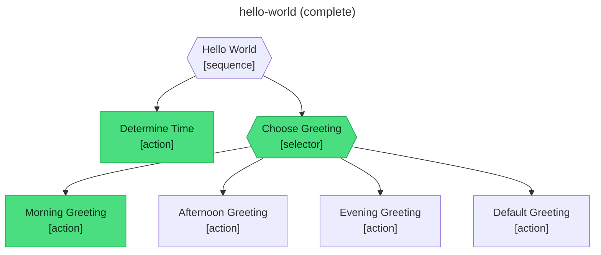

# Getting started

A five-minute walkthrough: install abtree, hand a tree to your agent, and watch it drive.

## Install

::: code-group

```sh [macOS / Linux]
curl -fsSL https://github.com/flying-dice/abtree/releases/latest/download/install.sh | sh
```

```powershell [Windows]
irm https://github.com/flying-dice/abtree/releases/latest/download/install.ps1 | iex
```

:::

Verify:

```sh
abtree --version
```

You'll see a version number. If you don't, restart your terminal so the new `PATH` takes effect.

## Concepts in 60 seconds

Three words worth knowing:

- **Tree** — a YAML file describing a workflow. Lives in `.abtree/trees/`.
- **Execution** — one run of a tree, bound to a piece of work. Persists as JSON in `.abtree/executions/`.
- **Step** — the smallest unit. Either an `evaluate` (a precondition the agent confirms) or an `instruct` (work the agent performs).

abtree is a CLI **for agents**. You don't drive executions yourself — you hand a brief to your agent and it runs the loop. Three commands carry the whole protocol: `abtree next` to ask "what now?", `abtree eval` to answer a precondition, `abtree submit` to report an outcome. JSON in, JSON out.

## 1. Set up a workspace

```sh
mkdir my-abtree-demo && cd my-abtree-demo
mkdir -p .abtree/trees/hello-world
curl -fsSL https://raw.githubusercontent.com/flying-dice/abtree/main/.abtree/trees/hello-world/TREE.yaml \
  -o .abtree/trees/hello-world/TREE.yaml
```

`hello-world` is a small tree: classify the time of day, then pick the matching greeting from a four-way selector. It exercises three of the four behaviour-tree primitives — `sequence`, `selector`, and `action` — in a few dozen lines.

## 2. Hand it off to your agent

In Claude Code, ChatGPT, or any agent that can run shell commands, send:

```text
Run the abtree hello-world tree end-to-end. Start by running
'abtree --help' to learn the execution protocol, then create an
execution with 'abtree execution create hello-world "first run"' and drive
it through every step until you see status: done.
```

That is the entire human-side interaction. The agent reads the protocol from `--help`, creates an execution, and runs the loop autonomously.

## 3. What the agent does under the hood

Each turn, the agent calls one command and reads its JSON response.

The very first `abtree next` on any execution is a runtime-level gate that hands the agent the execution protocol — every execution starts here, regardless of which tree it's running:

```json
{
  "type": "instruct",
  "name": "Acknowledge_Protocol",
  "instruction": "Read the runtime protocol below in full..."
}
```

The agent reads the protocol and acknowledges:

```sh
abtree submit first-run__hello-world__1 success
```

After the gate, `abtree next` returns the tree's first real step:

```json
{
  "type": "instruct",
  "name": "Determine_Time",
  "instruction": "Check the system clock to get the current hour..."
}
```

The agent does the work — checks the clock, classifies the hour as `morning` — then writes the result and submits:

```sh
abtree local write first-run__hello-world__1 time_of_day "morning"
abtree submit first-run__hello-world__1 success
```

The next call returns an `evaluate`:

```json
{
  "type": "evaluate",
  "name": "Morning_Greeting",
  "expression": "$LOCAL.time_of_day is \"morning\""
}
```

The agent reads the expression, decides it holds, and answers:

```sh
abtree eval first-run__hello-world__1 true
```

The loop repeats — `next` → do the work or judge the precondition → `submit` or `eval` — until:

```json
{ "status": "done" }
```

The agent never sees the rest of the tree. Just the next request.

## 4. The execution diagram

abtree regenerates a Mermaid diagram at `.abtree/executions/first-run__hello-world__1.mermaid` after every state change. Here's what a completed `hello-world` run looks like — green nodes succeeded, uncoloured ones were skipped.



The cursor advanced through the sequence. The selector chose Morning Greeting after its `evaluate` precondition held — the afternoon, evening, and default branches were never entered.

## What just happened

Your agent drove a structured workflow without you writing a system prompt, without a JSON schema in its context, without chain-of-thought. The tree handed it exactly one task at a time, and only let it advance when it proved the task was complete.

That's the core idea: **deterministic structure for non-deterministic agents.**

## Next

- [Why behaviour trees?](/concepts/) — the problem they solve
- [State, branches, and actions](/concepts/state) — how the building blocks fit together
- [Writing your own trees](/guide/writing-trees) — YAML structure walkthrough
- [CLI reference](/guide/cli) — every command, every flag
