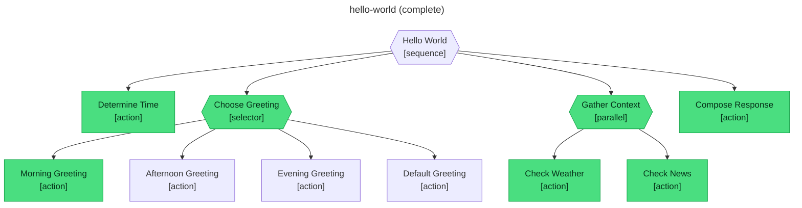

# Getting started

A five-minute walkthrough: install abtree, run the bundled `hello-world` tree, and see the live execution diagram.

## Install

::: code-group

```sh [macOS / Linux]
curl -fsSL https://github.com/flying-dice/abtree/releases/latest/download/install.sh | sh
```

```powershell [Windows]
irm https://github.com/flying-dice/abtree/releases/latest/download/install.ps1 | iex
```

:::

Verify:

```sh
abtree --version
```

You'll see a version number. If you don't, restart your terminal so the new `PATH` takes effect.

## Concepts in 60 seconds

Before you run anything, three words worth knowing:

- **Tree** — a YAML file describing a workflow. Lives in `.abtree/trees/`.
- **Flow** — one execution of a tree, bound to a piece of work. Persists as JSON in `.abtree/flows/`.
- **Step** — the smallest unit. Either an `evaluate` (a precondition the agent confirms) or an `instruct` (work the agent performs).

You drive a flow with three commands: `abtree next` to ask "what now?", `abtree eval` to answer an evaluate, `abtree submit` to acknowledge an instruct. That's the whole loop.

## Run the hello-world tree

`hello-world` is a small workflow that greets a user based on the time of day, then enriches the greeting with weather and news. It demonstrates all four behaviour-tree primitives in fifteen lines.

### 1. Set up a workspace

```sh
mkdir my-abtree-demo && cd my-abtree-demo
mkdir -p .abtree/trees
curl -fsSL https://raw.githubusercontent.com/flying-dice/abtree/main/.abtree/trees/hello-world.yaml \
  -o .abtree/trees/hello-world.yaml
```

Confirm the tree is visible:

```sh
abtree tree list
```

### 2. Create a flow

```sh
abtree flow create hello-world "first run"
```

You'll get a flow document back, including an ID like `first-run__hello-world__1`. Save that ID — every subsequent command takes it as the first argument.

### 3. Drive the loop

```sh
abtree next first-run__hello-world__1
```

Output:

```json
{
  "type": "instruct",
  "name": "Determine_Time",
  "instruction": "Check the system clock to get the current hour..."
}
```

Do what the instruction says — check the time, classify it as morning/afternoon/evening — then store the result and submit:

```sh
abtree local write first-run__hello-world__1 time_of_day "morning"
abtree submit first-run__hello-world__1 success
```

Now `abtree next` again. You'll get an `evaluate` step asking whether `$LOCAL.time_of_day is "morning"`. Answer:

```sh
abtree eval first-run__hello-world__1 true
```

Continue: `next` → do the work / answer the evaluate → `submit` or `eval`. Repeat until you see:

```json
{ "status": "done" }
```

### 4. See what happened

abtree regenerates a Mermaid diagram of the flow at `.abtree/flows/first-run__hello-world__1.mermaid` after every state change. Here's what a completed `hello-world` run looks like — green nodes succeeded, uncoloured ones were skipped.



The cursor advanced through the sequence. The selector chose Morning Greeting and stopped — the afternoon, evening, and default branches were never entered. Both context-gathering actions ran in parallel. Every action passed its `evaluate` invariant before its `instruct` ran.

## What just happened

You drove a structured workflow without writing a system prompt, without a JSON schema in your context, without chain-of-thought. The tree handed you exactly one task at a time and only let you advance when you proved you completed it.

That's the core idea: **deterministic structure for non-deterministic agents.**

## Next

- [Why behaviour trees?](/concepts/) — the problem they solve
- [State, branches, and actions](/concepts/state) — how the building blocks fit together
- [Writing your own trees](/guide/writing-trees) — YAML structure walkthrough
- [CLI reference](/guide/cli) — every command, every flag
