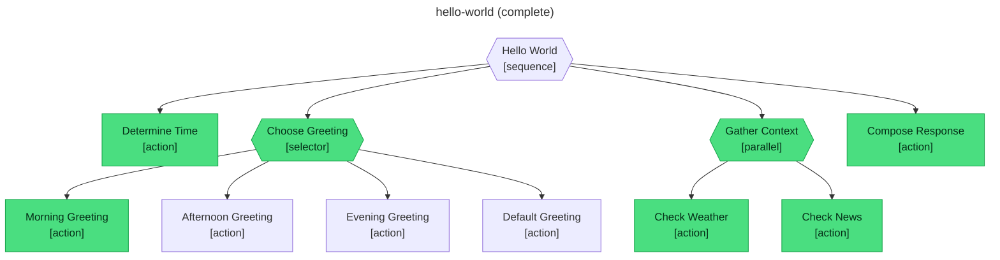

# Inspecting flows

You drove a flow. abtree wrote two files to disk. This page explains what's in them, where to find them, and what to look for when something doesn't go as expected.

## File layout

Every flow produces two files in `.abtree/flows/`:

```
.abtree/
  flows/
    first-run__hello-world__1.json     ← the full flow document
    first-run__hello-world__1.mermaid  ← a live execution diagram
```

The basename is the **flow ID** — kebab-cased summary, two underscores, tree slug, two underscores, an incrementing counter. abtree generates it for you when you run `abtree flow create`; it's stable for the life of the flow.

Both files are regenerated atomically on every state change (every `eval`, `submit`, or `local write`). Open them in any editor, `cat` them, commit them, ship them as artefacts — they're plain UTF-8 text.

## The JSON document

The JSON file is the source of truth for one flow. Every command — `next`, `eval`, `submit`, `local read` — reads from this document. There is no in-memory state the file doesn't contain; kill the process and the next `abtree next` resumes exactly where you left off.

Top-level shape:

```json
{
  "id":         "first-run__hello-world__1",
  "tree":       "hello-world",
  "summary":    "first run",
  "status":     "running",
  "snapshot":   "<JSON-encoded tree definition>",
  "cursor":     "<JSON-encoded position>",
  "phase":      "performing",
  "created_at": "2026-05-09T11:59:22.076Z",
  "updated_at": "2026-05-09T11:59:28.256Z",
  "local":      { ... },
  "global":     { ... }
}
```

### Field reference

| Field | Meaning |
|---|---|
| `id` | The flow ID. Matches the filename. |
| `tree` | Slug of the tree this flow was created from. |
| `summary` | The human label you passed to `flow create`. |
| `status` | `running`, `complete`, or `failed`. The terminal state of the workflow. |
| `snapshot` | A JSON-encoded copy of the tree definition at flow-creation time. The flow runs against this snapshot, not the live YAML — editing `.abtree/trees/<slug>.yaml` after creation does not affect existing flows. |
| `cursor` | A JSON-encoded position inside the tree. `null` means "no step in flight"; otherwise an object like `{"path":[1,0],"step":1}` pointing at a node and a step within it. |
| `phase` | `idle` (no current request), `performing` (an `instruct` is in flight, awaiting `submit`), or `evaluating` (an `evaluate` is in flight, awaiting `eval`). |
| `created_at` / `updated_at` | ISO 8601 timestamps. `updated_at` advances on every mutation. |
| `local` | The `$LOCAL` blackboard — per-flow key/value state your tree reads and writes. |
| `global` | The `$GLOBAL` world model — read-only environment values defined in the tree's `state.global` block. |

> The term **blackboard** comes from the BT and game-AI literature. It's just a key/value store scoped to one flow, used to pass data between steps.

### Runtime bookkeeping

Beside `local` and `global`, every flow document has a `runtime` field. This is **internal state owned by the tick engine** and is never exposed by `abtree local read` / mutated by `abtree local write` — the CLI's local commands only ever touch `doc.local`.

```json
{
  "runtime": {
    "node_status": { "0": "success", "1.0": "failure", ... },
    "step_index":  { "1.0": 1, ... },
    "retry_count": { "1": 2, ... }
  }
}
```

| Subfield | Meaning |
|---|---|
| `node_status` | `success` or `failure` for every node the runtime has settled. Keys are dot-joined positions (e.g. `1.0` is the first child of the second top-level node). |
| `step_index` | Current step within an action — used to resume a multi-step action without losing your place. |
| `retry_count` | Times the runtime has consumed a retry on a node with `retries:` config. Compared against the node's configured limit on each failure. |

Older flows (created before the runtime/local split) had these keys mixed in with `local` under prefixes like `_node_status__*` and `_step__*`. abtree migrates them lazily on the next read — the legacy keys disappear from `local` and reappear under `runtime`.

## The Mermaid diagram

The `.mermaid` file is a live tree-shaped trace of what the runtime has done so far. Open it in any Mermaid renderer — GitHub previews them inline, VS Code has a preview extension, the `mermaid-cli` tool exports PNG/SVG.

Three colour states tell you everything:

| Node colour | Meaning |
|---|---|
| **Green** (`#4ade80`) | The node ran and succeeded. |
| **Red** (`#f87171`) | The node ran and failed. |
| **Uncoloured** (default substrate) | The runtime never reached this node — usually because a sibling selector branch won, or a parent already failed. |

Two diagram shapes carry meaning too:

- **`{{rhombus-style}}`** — a composite node (`sequence`, `selector`, or `parallel`). The label includes `[sequence]`, `[selector]`, or `[parallel]` so you know which.
- **`["rectangle"]`** — an action (a leaf — work the agent performs).

A completed `hello-world` run looks like this:



Every reachable node is green. The selector picked Morning Greeting; the afternoon, evening, and default branches stayed uncoloured because a sibling already won. Both halves of the parallel ran. The sequence advanced through every direct child top to bottom.

## Debugging a stuck flow

Three pieces of the JSON document point at the cursor — together they tell you what the runtime is waiting on:

| Field | Tells you |
|---|---|
| `status` | `running` if the flow is still in flight; `complete` or `failed` if it terminated. |
| `phase` | `evaluating` if `abtree next` will return an `evaluate`; `performing` if it will return an `instruct`; `idle` if `abtree next` will tick the tree and pick the next request. |
| `cursor` | The path-and-step pointer into the tree. `{"path":[2,1],"step":0}` means "the second child of the third top-level node, step zero". |

Common situations:

- **`status: running`, `phase: idle`, `cursor: null`.** Healthy mid-flow state between requests. Call `abtree next` to advance.
- **`phase: performing` for hours.** The agent picked up an `instruct` and never reported back. The flow is waiting for `abtree submit <id> success | failure`. Resume it by submitting, or call `abtree flow reset <id>` to start over.
- **`status: failed`.** A `selector` exhausted all its children, or an action in a `sequence` failed. Look at the `_node_status__*` keys in `$LOCAL` to see which node was the immediate cause; look at the leaf's `evaluate` expression in the `snapshot` to see why it didn't pass.
- **The mermaid diagram has red nodes but `status: running`.** A failure was recorded but a parent (selector) is still trying alternatives. The flow is fine — read the next `abtree next` to see what's coming.

For a richer dump, `abtree flow get <id>` returns the same JSON as the on-disk file, formatted to stdout. Useful for piping into `jq` or `python -m json.tool`.

## Next

- [CLI reference](/guide/cli) — every command that mutates these files.
- [Writing your own tree](/guide/writing-trees) — the YAML the `snapshot` field captures.
- [Branches and actions](/concepts/branches-and-actions) — the four primitives you'll see in the diagram.
