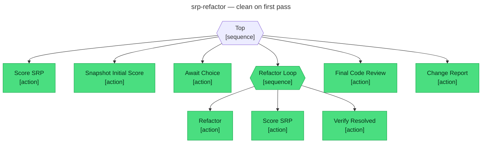

# srp-refactor

An [abtree](https://abtree.sh) workflow for refactoring Single Responsibility Principle (SRP) violations. The workflow scores a codebase, asks you to choose one violation to fix, refactors it in a bounded loop, runs a code review on the result, and writes a before-and-after report.

## Prerequisites

Install the following on your PATH:

- abtree CLI — see [Getting started](https://abtree.sh/getting-started) for install instructions
- An agent. abtree is agent-agnostic; the examples below use [Claude Code CLI](https://docs.claude.com/claude-code)
- A node package manager — [Bun](https://bun.sh), [pnpm](https://pnpm.io), or [npm](https://www.npmjs.com)

## Install

Choose one of the two options below. Either way, also install the abtree skill if your agent doesn't already have it — it's the prompt template that teaches the agent how to drive an abtree execution. If you kick off the workflow and the agent doesn't seem to know what to do, the skill is missing:

```sh
abtree install skill
```

### Option A — per-repo (recommended)

In the repository you want to refactor:

```sh
npm install --save-dev github:flying-dice/abtree_srp-refactor    # or `pnpm add -D github:…` or `bun add --dev github:…`
```

This writes the workflow to `./node_modules/abtree_srp-refactor/`. It's a dev-time tool — nothing ships in your runtime bundle.

### Option B — global

Install once, run from any repository:

```sh
npm install -g github:flying-dice/abtree_srp-refactor    # or `pnpm add -g github:…` or `bun add -g github:…`
```

The tree lands at `$(npm root -g)/abtree_srp-refactor/` (use `pnpm root -g` or `bun pm -g bin` for those managers). You'll reference that path when starting an execution — see [Run the workflow](#run-the-workflow) below.

## Run the workflow

The refactor loop edits source files in your working tree. Commit or stash first if you want a clean rollback point. The loop runs only after your explicit choice in step 2, so you can cancel after the initial scan if anything looks off.

1. Start an execution from inside the repository you want to refactor:

   ```sh
   # Option A — per-repo install
   claude 'Using the abtree cli, run the tree ./node_modules/abtree_srp-refactor'

   # Option B — global install
   claude "Using the abtree cli, run the tree $(npm root -g)/abtree_srp-refactor"
   ```

   The agent walks the tree and persists state to a new `.abtree/` directory at the repo root — gitignore it, or commit it if you want shareable run history.

2. After the initial scan the agent shows you the ranked SRP report and asks which violation to tackle. Reply with your pick (file path or label) — the agent writes it to execution state and the refactor loop kicks off. The initial scan is also frozen to `SRP_REPORT_INITIAL.md` so the final change report can compare before vs after.

3. The refactor loop runs up to four passes, then the code review, then the change report at `SRP_CHANGE_REPORT.md`.

## Files the workflow produces

| Path | Written by |
|---|---|
| `SRP_REPORT.md` | `Score_SRP` (overwritten on each pass) |
| `SRP_REPORT_INITIAL.md` | `Snapshot_Initial_Score` (before state) |
| `SRP_CHANGE_REPORT.md` | `Change_Report` (before-vs-after summary) |
| `.abtree/executions/<id>.json` | abtree runtime — full execution document |
| `.abtree/executions/<id>.mermaid` | abtree runtime — live diagram of the run |

## Workflow shape

The spine is in `main.yaml`. Each phase is a fragment under `fragments/`. The diagram below is the live trace from a run of `tests/clean-on-first-pass.yaml`; abtree regenerates the file on every state change.



## Repository layout

```
main.yaml                       Spine — name, version, state, and the 6-phase sequence
fragments/
  score-srp.yaml                Rank SRP violations and write SRP_REPORT.md
  snapshot-initial-score.yaml   Copy initial state to $LOCAL.initial_*
  await-choice.yaml             Pause for the human to choose a violation
  refactor.yaml                 Refactor $LOCAL.chosen_violation
  code-review.yaml              Run the multi-agent review procedure
  code-review.md                The review procedure (called by code-review.yaml)
  change-report.yaml            Write SRP_CHANGE_REPORT.md
tests/
  clean-on-first-pass.yaml      Refactor loop exits on the first pass
  clean-on-second-pass.yaml     Refactor loop retries once, then exits
  fixtures/handler.ts           Sample SRP violation that the specs reference
package.json                    Bun scripts for setup and tests
```

## Develop the workflow

To fork or modify this repo, clone it instead of installing:

```sh
git clone https://github.com/flying-dice/abtree_srp-refactor
cd abtree_srp-refactor
bun install                # or `pnpm install` or `npm install`
abtree install skill       # optional, if the agent doesn't already have it
```

Then run the tests below to verify your changes.

## Tests

Specs live in `tests/` and are driven by [`abtree_test-tree`](https://github.com/flying-dice/abtree_test-tree). Tests are not required to use the workflow — they verify it.

| Spec | Path exercised |
|---|---|
| `tests/clean-on-first-pass.yaml` | Refactor loop exits on the first pass |
| `tests/clean-on-second-pass.yaml` | First pass leaves a critical violation; retry resets the loop; second pass clears it |

```sh
bun run test:clean-on-first-pass    # or `pnpm run …` or `npm run …`
bun run test:clean-on-second-pass
```

Each script runs the spec through the test runner and writes a report to `tests/<scenario>__<timestamp>.md` with the mermaid trace embedded.

## Reference

- [abtree concepts](https://abtree.sh/concepts/)
- [Writing trees](https://abtree.sh/guide/writing-trees)
- [Designing workflows](https://abtree.sh/guide/designing-workflows)
- [Fragments](https://abtree.sh/guide/fragments)
- [Execute protocol](https://abtree.sh/guide/execute)
