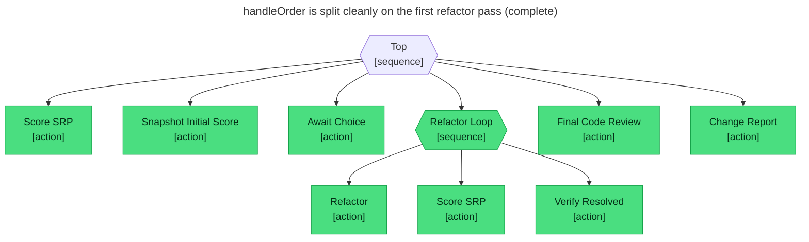

# Test report — handleOrder is split cleanly on the first refactor pass

**Tree:** ./TREE.yaml
**Spec:** tests/clean-on-first-pass.yaml
**Target execution:** handleorder-is-split-cleanly-on-the-firs__abtree_srp-refactor__2
**Overall:** PASS

## Final $LOCAL

| Key | Value |
|-----|-------|
| violations | [] |
| top_violation | null |
| has_critical_violations | false |
| srp_report | ./SRP_REPORT.md |
| initial_violations | [{"path":"tests/fixtures/handler.ts","severity":"critical","responsibilities":["HTTP routing","request validation","pricing","persistence","customer notifications","observability (logging + metrics)"],"rationale":"handleOrder mixes six unrelated concerns in one function body"}] |
| initial_top_violation | {"path":"tests/fixtures/handler.ts","severity":"critical"} |
| initial_has_critical_violations | true |
| initial_srp_report | ./SRP_REPORT_INITIAL.md |
| chosen_violation | tests/fixtures/handler.ts: handleOrder mixes routing, validation, pricing, persistence, notifications, and observability |
| refactor_complete | true |
| refactor_summary | Split tests/fixtures/handler.ts into single-responsibility modules:\n- handler.validation.ts — input parsing + schema checks\n- orderPricing.ts       — subtotal/tax/total\n- orderRepo.ts          — DB reads + writes\n- orderNotifications.ts — confirmation email\n- orderObservability.ts — audit log + metrics\nhandleOrder now only orchestrates these in order. |
| review_report | No high-signal issues found in the handleOrder split. |
| change_report | ./SRP_CHANGE_REPORT.md |

## Assertions

| Name | Expected | Actual | Pass |
|------|----------|--------|------|
| status | done | done | ✓ |
| local.chosen_violation | starts with tests/fixtures/handler.ts | tests/fixtures/handler.ts: handleOrder mixes routing, validation, pricing, persistence, notifications, and observability | ✓ |
| local.refactor_complete | true | true | ✓ |
| local.refactor_summary | non-empty | Split tests/fixtures/handler.ts into single-responsibility modules:... | ✓ |
| local.has_critical_violations | false | false | ✓ |
| local.review_report | non-empty | No high-signal issues found in the handleOrder split. | ✓ |
| local.initial_has_critical_violations | true | true | ✓ |
| local.change_report | ./SRP_CHANGE_REPORT.md | ./SRP_CHANGE_REPORT.md | ✓ |

## Trace

