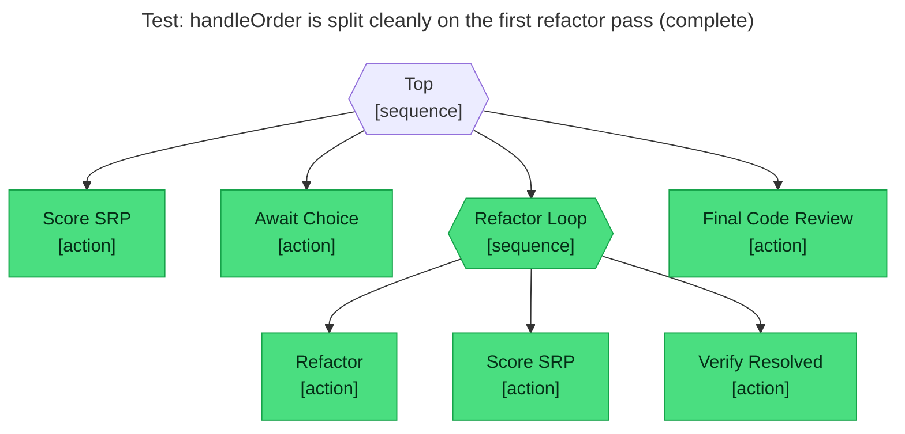

# Test report — handleOrder is split cleanly on the first refactor pass

**Tree:** ./TREE.yaml
**Spec:** tests/clean-on-first-pass.yaml
**Target execution:** test-handleorder-is-split-cleanly-on-the__abtree-example-tree__1
**Overall:** PASS

## Final $LOCAL

| Key | Value |
|-----|-------|
| violations |  |
| top_violation | null |
| has_critical_violations | false |
| srp_report | ./SRP_REPORT.md |
| chosen_violation | tests/fixtures/handler.ts: handleOrder mixes routing, validation, pricing, persistence, notificat... |
| refactor_complete | true |
| refactor_summary | Split tests/fixtures/handler.ts into single-responsibility modules:
- handler.validation.ts — inp... |
| review_report | No high-signal issues found in the handleOrder split. |

## Assertions

| Name | Expected | Actual | Pass |
|------|----------|--------|------|
| status | done | done | ✓ |
| local.chosen_violation | starts with tests/fixtures/handler.ts | tests/fixtures/handler.ts: handleOrder mixes ro... | ✓ |
| local.refactor_complete | true | true | ✓ |
| local.refactor_summary | non-empty | Split tests/fixtures/handler.ts into single-res... | ✓ |
| local.has_critical_violations | false | false | ✓ |
| local.review_report | non-empty | No high-signal issues found in the handleOrder ... | ✓ |

## Trace

