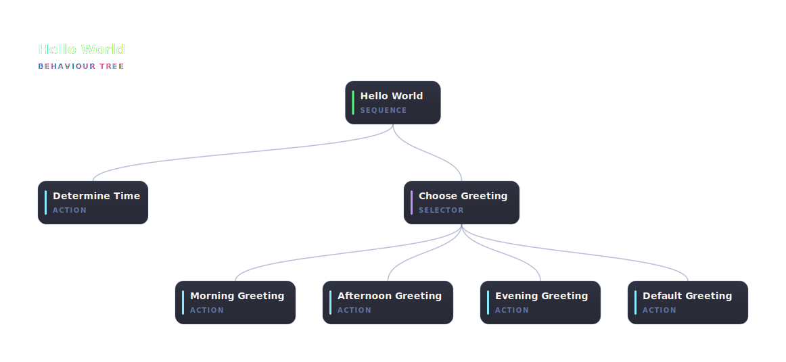

# @abtree/hello-world

Greet a user based on time of day. Demonstrates the `sequence`, `selector`, and `action` primitives, plus `delegate(...)` — a DSL helper that runs an inner stretch of the tree in a spawned subagent.

The `Compose_Greeting` scope is delegated: the parent submits a Spawn action that hands off to a haiku-class subagent (via `model: "haiku"`), which drives the inner selector + greeting action, then returns a build-time-generated exit token. The output gate on `$LOCAL.greeting` makes the scope fail if the subagent returned success without actually writing the slot. The parent then resumes at `Announce_Greeting`.

## Run it

Paste this brief into Claude Code, ChatGPT, or any shell-capable agent:

```text
Install the npm package @abtree/hello-world, then drive the workflow:

  abtree --help
  abtree execution create ./node_modules/@abtree/hello-world/main.json "Greet me based on the current time"
```



