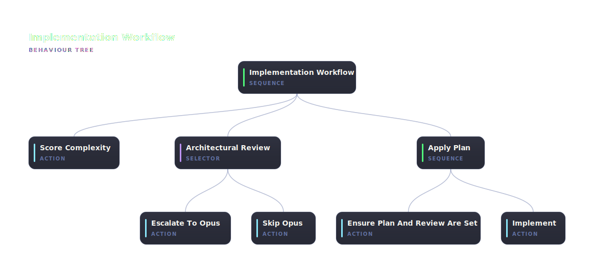

# @abtree/implement

Implement an approved plan with complexity-gated architectural review, following the clean-code rules in `clean-code.md`.



## Run it

Paste this brief into Claude Code, ChatGPT, or any shell-capable agent. Replace `<plan-name>` with the filename of an approved plan in `plans/`:

```text
Install the npm package @abtree/implement, then drive the workflow:

  abtree --help
  abtree execution create ./node_modules/@abtree/implement "Implement plans/<plan-name>.md"
```

