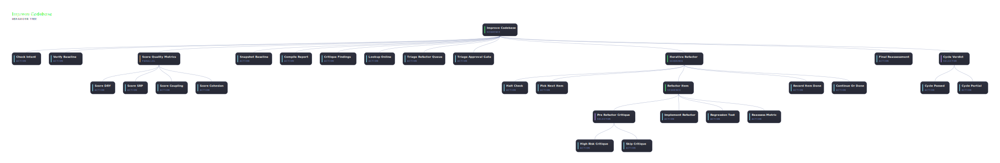

# @abtree/improve-codebase

Continuous code-improvement cycle. Confirms intent + green baseline, scores quality metrics in parallel, snapshots the baseline, hardens findings via a Senior-Principal critique, looks up best practices, triages with a human gate, then iterates through each refactor with per-item bounded retries until the queue is drained.



## Run it

Paste this brief into Claude Code, ChatGPT, or any shell-capable agent. The workflow requires a green baseline before it runs:

```text
Install and drive the @abtree/improve-codebase workflow against this repo:

  npm i --save-dev @abtree/improve-codebase
  abtree --help
  abtree execution create ./node_modules/@abtree/improve-codebase "Run an improvement cycle on src/"
```

## Install and run

See [Using a tree](https://abtree.sh/guide/using-trees) for the long-form walkthrough. `<pkg>` for this tree is `@abtree/improve-codebase`.
