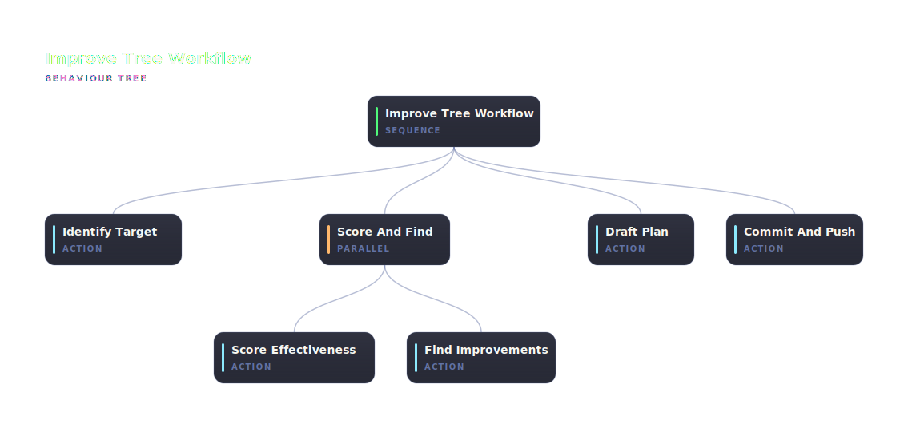

# @abtree/improve-tree

Score the effectiveness of a tree using evidence from one of its sessions, find improvements in parallel, draft a plan in `plans/`, then commit and push.



## Run it

Paste this brief into Claude Code, ChatGPT, or any shell-capable agent. Replace `<execution-id>` with the id of the session you want to learn from:

```text
Install and drive the @abtree/improve-tree workflow against this repo:

  npm i --save-dev @abtree/improve-tree
  abtree --help
  abtree execution create ./node_modules/@abtree/improve-tree "Improve this tree using evidence from .abtree/executions/<execution-id>.json"
```

## Install and run

See [Using a tree](https://abtree.sh/guide/using-trees) for the long-form walkthrough. `<pkg>` for this tree is `@abtree/improve-tree`.
