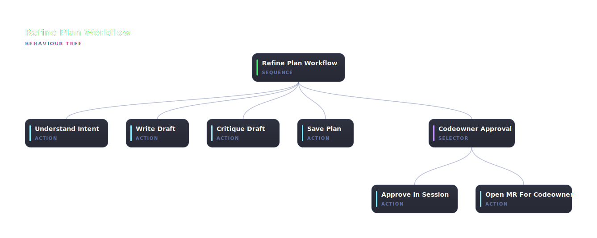

# @abtree/refine-plan

Refine a change request into an approved plan: analyse intent, draft to a per-execution draft file, critique it in place, promote to `plans/`, then take it through codeowner approval (either in-session or via an assigned MR).



## Run it

Paste this brief into Claude Code, ChatGPT, or any shell-capable agent. Replace `<change request>` with the work you want a plan for:

```text
Install and drive the @abtree/refine-plan workflow against this repo:

  npm i --save-dev @abtree/refine-plan
  abtree --help
  abtree execution create ./node_modules/@abtree/refine-plan "Refine change request: <change request>"
```

## Install and run

See [Using a tree](https://abtree.sh/guide/using-trees) for the long-form walkthrough. `<pkg>` for this tree is `@abtree/refine-plan`.
