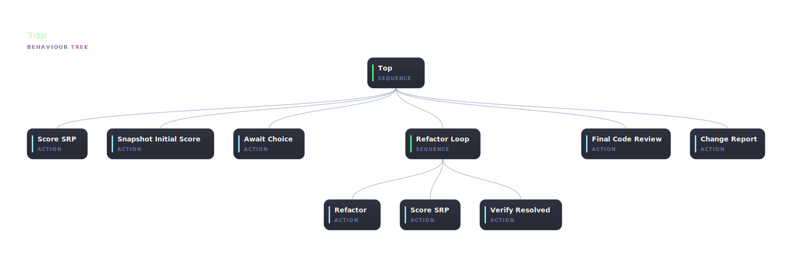

# srp-refactor

An [abtree](https://abtree.sh) workflow for refactoring Single Responsibility Principle (SRP) violations. The workflow scores a codebase, asks you to choose one violation to fix, refactors it in a bounded loop, runs a code review on the result, and writes a before-and-after report.



## Run it

Paste this brief into Claude Code, ChatGPT, or any shell-capable agent:

```text
Install the npm package @abtree/srp-refactor, then drive the workflow against this repo:

  abtree --help
  abtree execution create ./node_modules/@abtree/srp-refactor "Refactor the worst SRP violation in src/"
```

The refactor loop edits source files in your working tree. **Commit or stash first** if you want a clean rollback point. The loop only runs after your explicit choice in step 2 below, so you can safely cancel after the initial scan.

## What the workflow does

1. **Initial scan.** Scores every non-trivial module for SRP violations and writes `SRP_REPORT.md`. The scan is also snapshotted to `SRP_REPORT_INITIAL.md` so the final report can show before-vs-after.
2. **Human choice.** The agent shows you the ranked report and asks which violation to tackle. Reply with your pick (file path or label).
3. **Refactor loop.** Up to four passes — each pass refactors, re-scores, and either exits (no critical violations remain) or retries.
4. **Code review.** Multi-agent review of the diff produced by the loop.
5. **Change report.** Writes `SRP_CHANGE_REPORT.md` summarising what changed.

## Files the workflow produces

| Path | Written by |
|---|---|
| `SRP_REPORT.md` | `Score_SRP` (overwritten on each pass) |
| `SRP_REPORT_INITIAL.md` | `Snapshot_Initial_Score` (before state) |
| `SRP_CHANGE_REPORT.md` | `Change_Report` (before-vs-after summary) |

The standard `.abtree/executions/<id>.{json,mermaid,svg}` artefacts are also written — see [Using a tree → What gets written](https://abtree.sh/guide/using-trees#what-gets-written).

## Develop this workflow

To fork or modify, clone instead of installing:

```sh
git clone https://github.com/flying-dice/abtree
cd abtree/trees/srp-refactor
bun install
```

Tree source is in `src/tree.ts` (authored with the [abtree DSL](https://abtree.sh/guide/writing-trees)); `bun run build` emits `main.json`. The multi-agent review procedure lives at `fragments/code-review.md`.

## Tests

Specs in `tests/` are driven by [`@abtree/test-tree`](https://github.com/flying-dice/abtree/tree/main/trees/test-tree):

| Spec | Path exercised |
|---|---|
| `tests/clean-on-first-pass.yaml` | Refactor loop exits on the first pass |
| `tests/clean-on-second-pass.yaml` | First pass leaves a critical violation; retry resets the loop; second pass clears it |

```sh
bun run test:clean-on-first-pass
bun run test:clean-on-second-pass
```

Each script runs the spec through the test runner and writes a report next to the spec with the mermaid trace embedded.
