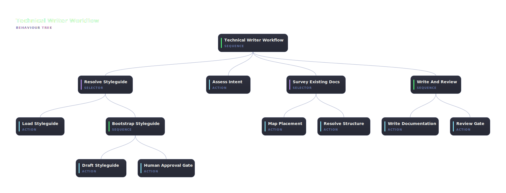

# @abtree/technical-writer

Take a documentation goal, ground it in the repo's styleguide, find or build a home in the docs tree, write to it, and gate-check structure / flow / atomicity. Up to three write/review passes (one initial + two retries) before surfacing failure to the human.

## Run it

Paste this brief into Claude Code, ChatGPT, or any shell-capable agent. Replace `<documentation goal>` with what you want documented:

```text
Install the npm package @abtree/technical-writer, then drive the workflow against this repo:

  abtree --help
  abtree execution create ./node_modules/@abtree/technical-writer/main.json "Document <documentation goal> in docs/"
```



