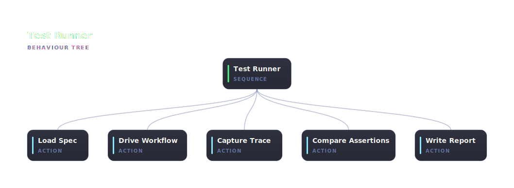

# @abtree/test-tree

An [abtree](https://abtree.sh) fragment that runs a BDD test spec against a target tree, captures its mermaid trace, compares the run's final state against the spec's `then` assertions, and writes a markdown test report with the diagram embedded.



## Run it

Paste this brief into Claude Code, ChatGPT, or any shell-capable agent. Replace `<scenario>.yaml` with the path to your BDD spec:

```text
Install the npm package @abtree/test-tree, then drive the workflow:

  abtree --help
  abtree execution create ./node_modules/@abtree/test-tree "Run the BDD spec at tests/<scenario>.yaml"

The runner reads $LOCAL.test_path from the execution. Seed it before
the first `abtree next`:

  abtree local write <execution-id> test_path ./tests/<scenario>.yaml
```

## Spec layout

Test specs live in a `tests/` directory next to the target tree. The directory itself signals these are tests — no `TEST__` prefix needed. The runner writes each report next to its spec; the `.yaml` vs `.md` extension distinguishes them.

```
<target-tree>/
├── main.json
└── tests/
    ├── short-topic.yaml
    ├── long-topic.yaml
    └── short-topic__20260511T134200Z.md
```

A minimal spec:

```yaml
feature: "What the tree does"
tree: <target-tree-slug>
scenario:
  name: <human-readable scenario name>
  given: <one-line context>
  when:
    - { evaluate: "<expression>", result: true }
    - { instruct: "<name>", write: { <key>: <value> }, submit: success }
    - ...
  then:
    status: done
    local:
      <key>: <expected value or predicate>
    files:
      <key>: <expected on-disk shape>
```

## Fixtures (VCR semantics)

External side effects (git push, MR open, network calls) are served from `fixtures.side_effects` in the spec rather than performed for real, unless the operator has explicitly authorised live execution:

```yaml
fixtures:
  side_effects:
    mr_open:
      url: https://example.test/mr/42
      branch: feature/scenario-x
```

If an instruction would normally require external authorisation and there's no fixture for it, the runner submits failure rather than inventing a value.

## State surface

| Key | Set by | Purpose |
|---|---|---|
| `test_path` | caller | path to the `<scenario>.yaml` spec |
| `test_spec` | runner | parsed spec object |
| `target_execution_id` | runner | id of the run-under-test |
| `final_local` | runner | full `$LOCAL` of the target execution at termination |
| `final_status` | runner | `"done"` or `"failure"` |
| `mermaid_diagram` | runner | verbatim contents of `.abtree/executions/<id>.mermaid` |
| `assertions` | runner | `[{ name, expected, actual, pass }, …]` |
| `overall_result` | runner | `"pass"` or `"fail"` |
| `report_path` | runner | path to the rendered markdown report |

## Report format

The generated `<scenario>__<timestamp>.md` contains:

- Title, target tree slug, spec path, target execution id, overall PASS/FAIL.
- A table of the final `$LOCAL`.
- A table of each assertion (Name | Expected | Actual | Pass).
- The full mermaid trace inline.
